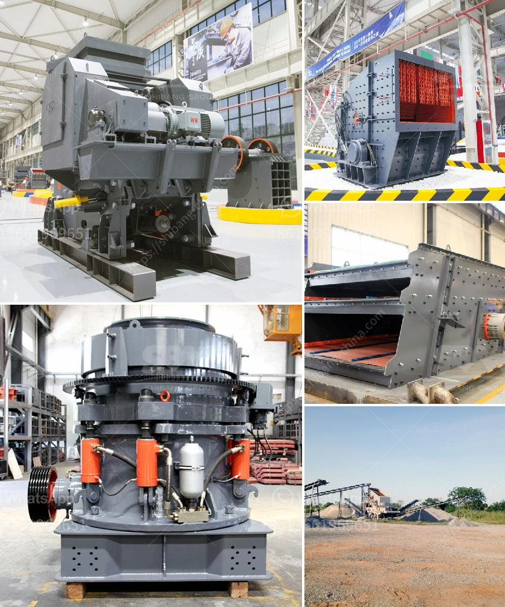

<h3>ball mill price in india</h3>
The Ball Mill is one of the most important pieces of equipment in the mineral processing industry due to its simple yet efficient working principle. It involves grinding ores and other materials to a typical product size of 35 mesh or finer. With its wide range of applications, the ball mill has become an indispensable machine in the mining industry.

When it comes to purchasing a ball mill, many customers might be concerned about whether the price is reasonable. To understand the ball mill price in India, we first need to consider the following factors. The quality of the mill affects the price. In addition, the prices of different manufacturers, production technologies, and regions are different. If you want to buy a cheap ball mill, it is recommended to go to the factory or workshop for on-site inspection. However, the quality of the equipment will be greatly reduced compared to the factory price. In addition, there are many middlemen who sell ball mills that also hinder the price of the product.

Speaking of the mill price, there are many factors that need to be considered. Generally speaking, the factors affecting the price of the mill mainly include the following aspects: model, production capacity, quality, manufacturers, operation, after-sales service, etc. The above factors play an important role in the mill price structure. In addition, because of the differences in the specific configuration of the mill, the price may also vary greatly. Therefore, when buying a ball mill, customers can not only consider the price of the mill, but also carefully analyze which factors affect the mill price.

Firstly, the model of the ball mill is an important factor that influences the price of the equipment. Generally speaking, the larger the model, the more expensive the price. For example, the ball mill with a diameter of 1500mm and a length of 2400mm is priced at around 20 million. This is just a rough estimate, and the specific quotation needs to be matched with the selected manufacturer.

Secondly, the production capacity of the ball mill is also an important factor affecting the mill price. Generally, the higher the production capacity, the higher the price. There are many models of ball mills with different production capacities to choose from. Customers need to make a choice based on their own production needs.

Thirdly, the quality of the ball mill will also directly affect the price. This factor cannot be ignored. A good quality ball mill has a longer service life and saves more costs for customers in the long run. Comparatively, a low-quality ball mill may have a lower price, but it may not be durable and may require frequent repairs, resulting in higher maintenance costs.

Fourthly, the manufacturer of the ball mill is an important factor as well. Different manufacturers have different production technologies and equipment quality. Therefore, the price may vary from manufacturer to manufacturer. It is recommended to choose a reliable and well-known manufacturer to ensure the overall quality of the equipment.

Lastly, the operation and after-sales service of the manufacturer must be taken into account. A good after-sales service can provide customers with technical support and equipment maintenance, thus reducing operating costs. Therefore, when purchasing a ball mill, it is necessary to consider the comprehensive factors, not just the price, in order to make a wise purchasing decision.

In conclusion, the price of a ball mill in India is influenced by various factors, including model, production capacity, quality, manufacturer, operation, and after-sales service. It is important to choose a suitable and reliable manufacturer to ensure the overall quality of the mill. By considering these factors and conducting thorough research, customers can make a wise decision and get the best value for their money.
<h3>Contact us</h3><ul><li><strong>Whatsapp:&nbsp;<a href="https://wa.me/8613661969651">+8613661969651</a></strong></li><li><a href="https://swt.shibang-china.com/?git&amp;zhl&amp;ball mill price in india"><strong>Online Service(chat now)</strong></a></li></ul><h3>Related</h3><ul><li><a href='stone crusher machine price in uganda.md'>stone crusher machine price in uganda</a></li><li><a href='automated roller conveyors.md'>automated roller conveyors</a></li><li><a href='calcium carbonate mining manufacturer in malaysia.md'>calcium carbonate mining manufacturer in malaysia</a></li><li><a href='how to charge grinding media in ball mill.md'>how to charge grinding media in ball mill</a></li><li><a href='limestone crushing power consumption.md'>limestone crushing power consumption</a></li></ul>