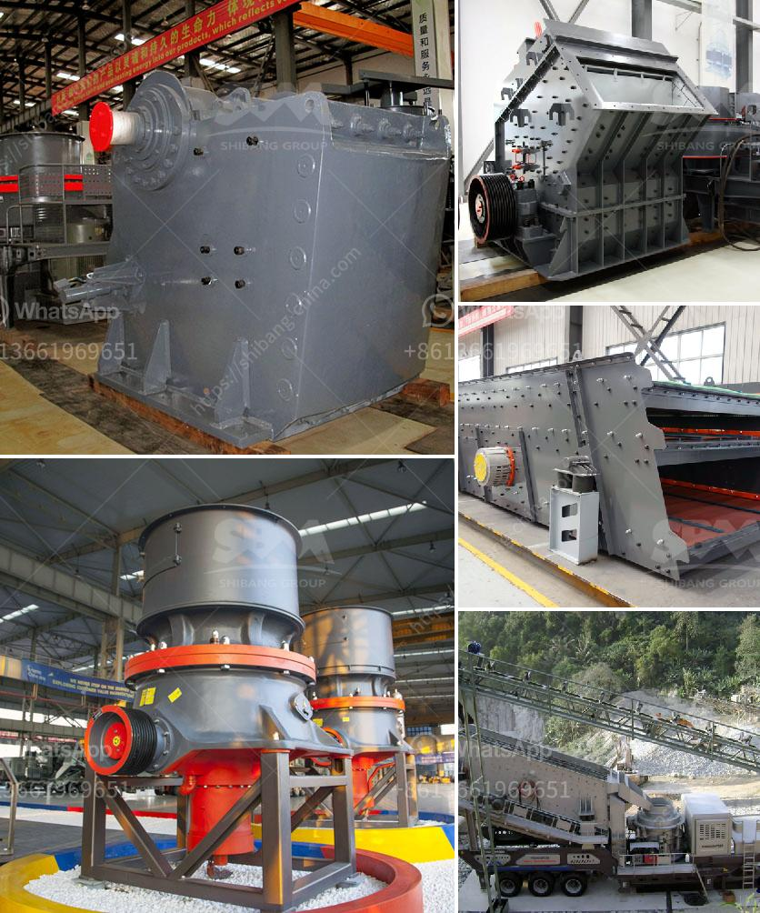

<h3>ball mill price mexico</h3>
The ball mill is a key equipment for grinding materials, widely used in powder-making production line such as cement, silicate sand, new-type building material, refractory material, fertilizer, ore dressing of ferrous metal and non-ferrous metal, glass ceramics, etc. Ball mill can grind various ores and materials with dry type or wet type.

When it comes to the price of ball mills in Mexico, it is always the most concerned topic for customers. With the rapid development of mining industry in Mexico, the demand for mining equipment, especially ball mills, is also increasing. Numerous suppliers are trying to provide customers with high-quality ball mills and favorable price.

The price of ball mills in Mexico can vary greatly depending on the manufacturer, the type of equipment, model, size, and the production capacity. Generally, the smaller the size of the ball mill, the lower the price. However, it is important to consider other factors such as the longevity, energy efficiency, and overall performance of the equipment.

In Mexico, there are a variety of ball mill manufacturers, including large multinational corporations and local manufacturers. The price offered by these manufacturers may also differ. Large multinational corporations usually have higher production costs and may pass these costs onto the customers, resulting in a higher price. On the other hand, local manufacturers may have lower production costs and can offer more competitive prices.

Another factor that affects the price of ball mills in Mexico is the type of equipment. There are several types of ball mills, including overflow ball mills, grate discharge ball mills, and batch ball mills. Each type has its own advantages and disadvantages, and the price can vary accordingly. It is essential to consider the specific requirements of the application when choosing the type of ball mill.

Furthermore, the production capacity of the ball mill can also impact the price. The larger the production capacity, the higher the price. Customers should determine their production needs and select a ball mill with an appropriate capacity.

Aside from the initial purchase price, customers should also consider the long-term operational and maintenance costs. A high-quality ball mill with better energy efficiency may have a higher initial price, but it can result in significant cost savings over time by reducing energy consumption and maintenance expenses.

In conclusion, the price of ball mills in Mexico can vary depending on various factors, including the manufacturer, type of equipment, model, size, and production capacity. Customers should carefully evaluate these factors and choose a ball mill that meets their specific requirements at a reasonable price. It is also advisable to consider the long-term operational and maintenance costs to ensure a cost-effective investment.
<h3>Contact us</h3><ul><li><strong>Whatsapp:&nbsp;<a href="https://wa.me/8613661969651">+8613661969651</a></strong></li><li><a href="https://swt.shibang-china.com/?git&amp;zhl&amp;ball mill price mexico"><strong>Online Service(chat now)</strong></a></li></ul><h3>Related</h3><ul><li><a href='mica powder mill malaysia.md'>mica powder mill malaysia</a></li><li><a href='drums of conveyor belts malaysia.md'>drums of conveyor belts malaysia</a></li><li><a href='10 tph trally mounted stone crusher made in india.md'>10 tph trally mounted stone crusher made in india</a></li><li><a href='gravel belt conveyor rental toronto.md'>gravel belt conveyor rental toronto</a></li><li><a href='gold washing machine for small miners.md'>gold washing machine for small miners</a></li></ul>