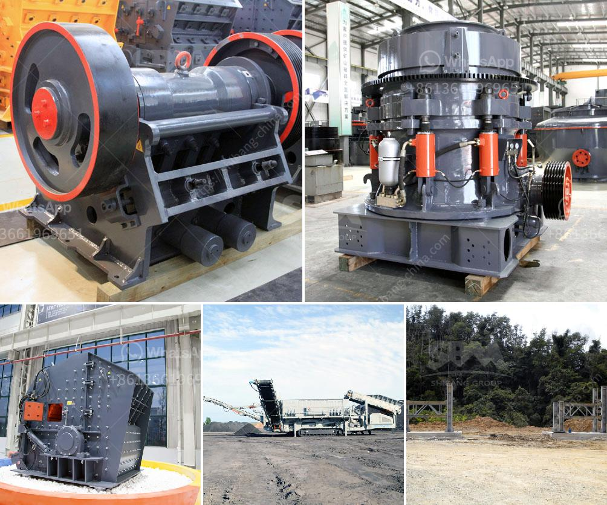

<h3>ball mill quartz</h3>
Ball mill quartz is used to grind materials into fine powder in order to be used in the production of ceramics, glass, and other industrial products. It works on the principle of impact and attrition: size reduction is done by impact as the balls drop from near the top of the shell. A ball mill consists of a hollow cylindrical shell rotating about its axis. The axis of the shell may be either horizontal or at a small angle to the horizontal. It is partially filled with balls which act as the grinding media. The inner surface of the cylindrical shell is usually lined with an abrasion-resistant material such as manganese steel or rubber.

Quartz, a mineral composed of silicon and oxygen atoms in a continuous framework of SiO₂, is one of the most abundant minerals on earth. It is found in different forms such as crystals, masses, grains, or veins. Ball mill quartz is the most commonly used method to grind quartz in order to obtain a fine powder used for various applications.

The ball mill quartz grinding system includes two sets of ball mills, one classification system, and a feeding system. The classification system consists of a spiral classifier, cyclone, and air separator. The structure of the ball mill quartz grinding system is simple, yet it ensures high efficiency and stability during operation.

The quartz powder obtained through ball mill quartz grinding is widely used in various industries, such as glass, ceramics, metallurgy, foundry, and construction. Quartz powder is also used in the manufacture of refractory materials, abrasives, and chemicals.

In the glass industry, ball mill quartz is used in the production of glass fibers, containers, and various glass products. The fine powder obtained from ball mill quartz grinding has high transparency and a high melting point, making it ideal for the production of high-quality glass products.

In the ceramics industry, ball mill quartz is used to grind and mix ceramic raw materials, resulting in a fine powder that can be used to produce high-quality ceramic tiles, sanitary ware, and other ceramic products. The use of ball mill quartz ensures uniform particle size distribution, improving the strength and properties of ceramic products.

In the metallurgy industry, ball mill quartz is used to grind and mix metal oxide powders, resulting in the production of metal oxides with controlled particle size and improved reactivity. This is particularly important in the production of catalysts, coatings, and pigments.

In the construction industry, ball mill quartz is used as a filler material in the production of concrete and mortar. The fine powder obtained from ball mill quartz grinding improves the workability and strength of concrete, making it suitable for various construction applications.

Overall, ball mill quartz grinding offers numerous benefits in various industries. It is a cost-effective method to obtain a fine powder with controlled particle size distribution, improving the performance and quality of various products. Its versatility makes it an essential tool in the manufacturing process of ceramics, glass, metallurgy, and construction materials.
<h3>Contact us</h3><ul><li><strong>Whatsapp:&nbsp;<a href="https://wa.me/8613661969651">+8613661969651</a></strong></li><li><a href="https://swt.shibang-china.com/?git&amp;zhl&amp;ball mill quartz"><strong>Online Service(chat now)</strong></a></li></ul><h3>Related</h3><ul><li><a href='vibrating screen troubleshooting.md'>vibrating screen troubleshooting</a></li><li><a href='rubble recycle concrete crusher hire.md'>rubble recycle concrete crusher hire</a></li><li><a href='stone medina stone mobile crusher.md'>stone medina stone mobile crusher</a></li><li><a href='chilli crushing machine project report.md'>chilli crushing machine project report</a></li><li><a href='stone crusher plant sweden.md'>stone crusher plant sweden</a></li></ul>