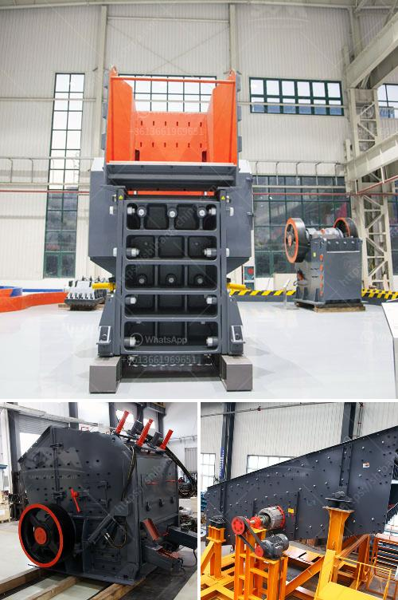

<h3>ball mill sale in cali</h3>
Are you looking for a reliable and efficient way to grind and mix materials? Look no further than a ball mill! As technology continues to advance, ball mills are becoming more versatile and crucial in various industries, especially in California. Whether you are in the mining, chemical, or construction sector, a ball mill can significantly enhance your productivity and efficiency.

A ball mill is a type of grinder used to grind and blend materials for use in mineral dressing processes, paints, pyrotechnics, ceramics, and selective laser sintering. It works on the principle of impact and attrition: size reduction is done by impact as the balls drop from near the top of the shell. This type of mill consists of a hollow cylindrical shell rotating about its axis, partially filled with grinding media such as ceramic or stainless-steel balls.

One of the primary reasons a ball mill is widely used in California is its capability to grind materials into extremely fine powder. By using a ball mill, you can obtain particles as small as a few micrometers, making it ideal for applications that require precise and uniform particle size distribution. This characteristic is especially crucial in the pharmaceutical and chemical industries, where the quality and consistency of the final product are of utmost importance.

Another advantage of a ball mill is its ability to perform both dry and wet grinding. You can process materials with high moisture content or in a slurry form, without compromising the efficiency of the grinding process. This versatility allows you to handle various materials, such as ores, chemicals, and even food products. Consequently, the ball mill has become an essential tool in the processing of raw materials, ensuring the desired particle size is achieved.

If you're in California and looking to purchase a ball mill, you're in luck! The state offers numerous options for ball mill sales and rentals. Numerous suppliers and manufacturers provide top-of-the-line ball mills designed to meet the specific needs of different industries. With various models and sizes available, finding the perfect ball mill that suits your requirements is now easier than ever.

When considering a ball mill for sale, it's important to look for manufacturers who prioritize quality, durability, and dependability. A reliable ball mill can provide years of efficient grinding performance, reducing downtime and operating costs. It's also essential to select a supplier that offers comprehensive after-sales service, including maintenance, spare parts, and technical support.

In conclusion, a ball mill is an indispensable tool for grinding and mixing materials in various industries. Its ability to grind materials into fine powder, its versatility in handling both dry and wet grinding, and the numerous options available for purchase in California make it an excellent investment for businesses and individuals alike. So, if you're in need of a ball mill, don't hesitate to explore the options available to you. With the right equipment, you'll be able to enhance your productivity and achieve superior results.
<h3>Contact us</h3><ul><li><strong>Whatsapp:&nbsp;<a href="https://wa.me/8613661969651">+8613661969651</a></strong></li><li><a href="https://swt.shibang-china.com/?git&amp;zhl&amp;ball mill sale in cali"><strong>Online Service(chat now)</strong></a></li></ul><h3>Related</h3><ul><li><a href='ball mill for grinding of soda feldspar.md'>ball mill for grinding of soda feldspar</a></li><li><a href='mill gypsum for sale in india.md'>mill gypsum for sale in india</a></li><li><a href='coal pulverizer machine price.md'>coal pulverizer machine price</a></li><li><a href='mobile crushers in abuja.md'>mobile crushers in abuja</a></li><li><a href='low cost gold mining equipment.md'>low cost gold mining equipment</a></li></ul>