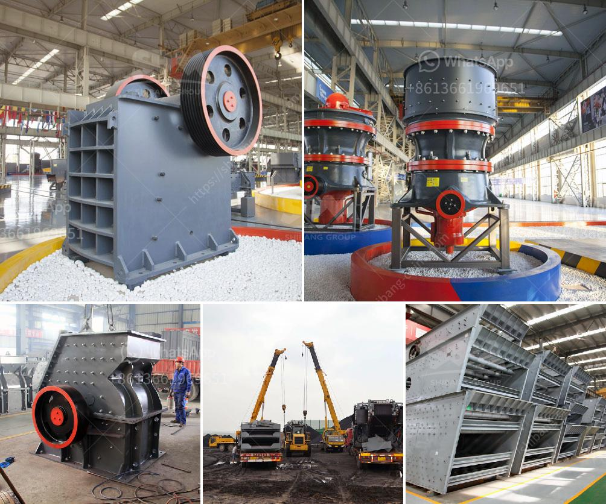

<h3>ball mill south africa</h3>
The South African gold mine ball mill market is gradually developing towards a diversified market. With numerous developments in the functional areas of the industry, expectations are within a favorable range. The market is actively exploring and introducing innovations that can effectively improve production efficiency and reduce costs. The emergence of a large number of advanced new technologies and equipment has greatly stimulated the development of the South African gold mine ball mill market.

The ball mill is widely used in the grinding of mineral products in the fields of metallurgy, building materials, chemicals, and mining. According to the fineness of the material to be ball milled and the fineness required by the user, it can be divided into various types of ball mills, such as dry ball mill and wet ball mill. In recent years, the wet ball mill machine has received continuous attention from users. It is our common equipment to grind materials into powder.

Recently, many customers in South Africa have inquired about the efficiency of the ball mill and have been seeking ways to increase efficiency. Our customer service department received a customer consultation, hoping to provide comprehensive and detailed information and technical support for a new gold mill project in South Africa.

After conducting a series of investigations, our technicians analyzed the crushing and grinding process of the ore, and proposed an improved beneficiation process and a more efficient ball mill grinding system. According to the specific production conditions, we manufactured a complete set of beneficiation and grinding equipment and delivered it to the customer's production site.

The South African gold mine ball mill project has been completed. The gold ball mill production line of the customer's production line is very impressive and brings customers high output, high efficiency, and long-term stability.

The ball mill is usually divided into a dry ball mill and a wet ball mill. Both the structure and working principles are different, but they are both efficient grinding equipment for processing fine materials. The appearance and internal structure of the two are basically the same, except that the wet ball mill has a charging port, which is used to add grinding water or other liquid for grinding. Different grinding media are used to achieve different results.

The wet ball mill has the advantages of large grinding capacity, low power consumption, stable operation, and reliable performance. It is suitable for the grinding of various ores and other materials, and is widely used in mineral processing, building materials, and chemical industries.

In summary, the South African gold mine ball mill market is expected to continue to grow in the future. However, market competition is fierce and the pace of development is accelerating. Customers should choose reliable ball mill manufacturers to improve production efficiency and reduce costs.
<h3>Contact us</h3><ul><li><strong>Whatsapp:&nbsp;<a href="https://wa.me/8613661969651">+8613661969651</a></strong></li><li><a href="https://swt.shibang-china.com/?git&amp;zhl&amp;ball mill south africa"><strong>Online Service(chat now)</strong></a></li></ul><h3>Related</h3><ul><li><a href='vibrating screen troubleshooting.md'>vibrating screen troubleshooting</a></li><li><a href='200 tph crusher plant.md'>200 tph crusher plant</a></li><li><a href='stone crushing machine suppliers.md'>stone +crushing +machine +suppliers</a></li><li><a href='silica sand washing machine.md'>silica sand washing machine</a></li><li><a href='cement grinding units manufacturing in bangalore.md'>cement grinding units manufacturing in bangalore</a></li></ul>