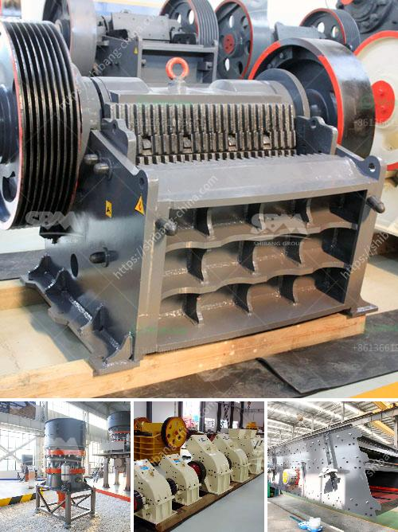

<h3>ball mill steel balls suppliers in nigeria</h3>
Ball mill steel balls are crucial grinding media for the mining industry and manufacturers all over the world are constantly striving to improve their quality. The properties of these balls, including size, hardness, and composition, are critical factors in their application. With the increasing demand for ore processing equipment in Nigeria, many manufacturers and suppliers of ball mill steel balls can be found here.

Nigeria is known for its abundant mineral resources, with over 44 varieties of minerals identified in the country, including gold, limestone, copper, iron ore, and zinc. Besides these, Nigeria holds substantial deposits of barite, talc, kaolin, bentonite, and gemstones. The mining industry in Nigeria has tremendous potential, and the need for efficient processing technologies, such as ball mills, is increasing.

Several steel ball suppliers in Nigeria offer a wide range of balls for various applications in the mining industry. They provide different sizes and densities to meet the diverse requirements of grinding and crushing operations. These suppliers often employ state-of-the-art production processes to ensure superior quality and consistency of their products.

Along with the quality, these suppliers also emphasize prompt delivery and excellent customer service. They understand the urgent demands of mining operations and strive to meet the deadlines set by their customers. Furthermore, they offer technical support and guidance to assist their clients in selecting the right steel balls for their specific needs.

However, it is essential for Nigerian mining companies and other potential buyers to perform due diligence when selecting their steel ball suppliers. They should consider factors such as experience, reputation, and certifications to ensure they are dealing with reliable and trustworthy suppliers. Additionally, it is recommended to request samples and conduct on-site inspections to verify the quality and compatibility of the steel balls with their equipment.

Overall, the presence of ball mill steel ball suppliers in Nigeria provides a valuable resource for the mining industry. These suppliers not only offer high-quality grinding media but also collaborate with their customers to optimize the grinding process and increase productivity. As the mining industry in Nigeria continues to grow, the importance of reliable suppliers becomes even more critical for sustainable and efficient operations.
<h3>Contact us</h3><ul><li><strong>Whatsapp:&nbsp;<a href="https://wa.me/8613661969651">+8613661969651</a></strong></li><li><a href="https://swt.shibang-china.com/?git&amp;zhl&amp;ball mill steel balls suppliers in nigeria"><strong>Online Service(chat now)</strong></a></li></ul><h3>Related</h3><ul><li><a href='jual jaw crusher bekas surabaya.md'>jual jaw crusher bekas surabaya</a></li><li><a href='small scale mining equipment price in zimbabwe.md'>small scale mining equipment price in zimbabwe</a></li><li><a href='sell jaw crusher jaw pe 250x400 tph.md'>sell jaw crusher jaw pe 250x400 tph</a></li><li><a href='coal pulverizer machine price.md'>coal pulverizer machine price</a></li><li><a href='used barite crusher price.md'>used barite crusher price</a></li></ul>