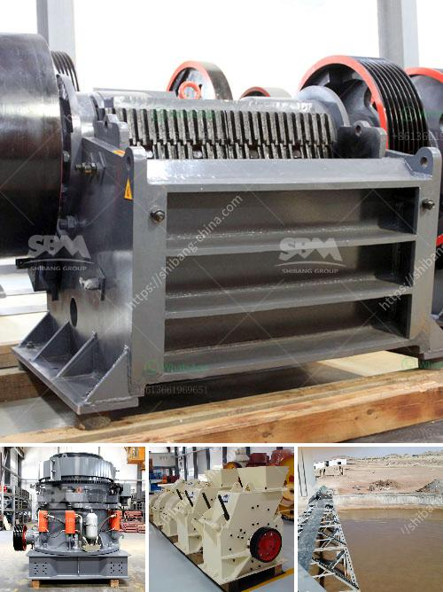

<h3>ball mill supplier in pune</h3>
The ball mill is an essential grinding equipment for mineral processing plants. It is primarily used for fine grinding operations in various industries. Today, we are going to take a closer look at the ball mill supplier in Pune.

Ball mills are used to grind and blend materials for use in mineral dressing processes, paints, pyrotechnics, ceramics, and selective laser sintering. They work on the principle of impact and attrition: the size reduction is done by impact as the balls drop from near the top of the shell. A ball mill consists of a hollow cylindrical shell rotating about its axis. The axis of the shell may be either horizontal or at a small angle to the horizontal. It is partially filled with balls.

Pune, a bustling city in western India, is home to numerous industrial establishments. Among them, there are several renowned ball mill suppliers. These suppliers provide high-quality ball mills with excellent performance for various applications. The ball mills supplied by the manufacturers are robust, durable, and low maintenance, thus ensuring a long lifespan and low operating costs.

The ball mill suppliers in Pune offer products that are designed to process multiple materials such as ores, clays, chemicals, and others. These mills can be used in both wet and dry grinding processes. The wide range of applications includes mineral processing, metallurgy, cement production, and pharmaceutical industries.

These suppliers in Pune maintain a comprehensive inventory of ball mills to meet the diverse needs of their customers. They offer customized solutions with different specifications, sizes, capacities, and grinding media options. The reputable suppliers ensure that the ball mills delivered adhere to the industry standards and are equipped with advanced features for efficient and precise grinding.

In conclusion, Pune boasts a range of reliable ball mill suppliers that provide top-quality equipment for various industries. These suppliers offer reliable, durable, and efficient ball mills that can be tailored to meet specific requirements. With their expertise and commitment to customer satisfaction, they are the preferred choice for ball mill procurement in Pune.
<h3>Contact us</h3><ul><li><strong>Whatsapp:&nbsp;<a href="https://wa.me/8613661969651">+8613661969651</a></strong></li><li><a href="https://swt.shibang-china.com/?git&amp;zhl&amp;ball mill supplier in pune"><strong>Online Service(chat now)</strong></a></li></ul><h3>Related</h3><ul><li><a href='stone crusher for sale in south korea.md'>stone crusher for sale in south korea</a></li><li><a href='specification of jaw crusher.md'>specification of jaw crusher</a></li><li><a href='best machine for marble processing.md'>best machine for marble processing</a></li><li><a href='rock crusher distributors in phillipinwes.md'>rock crusher distributors in phillipinwes</a></li><li><a href='sell jaw crusher jaw pe 250x400 tph.md'>sell jaw crusher jaw pe 250x400 tph</a></li></ul>