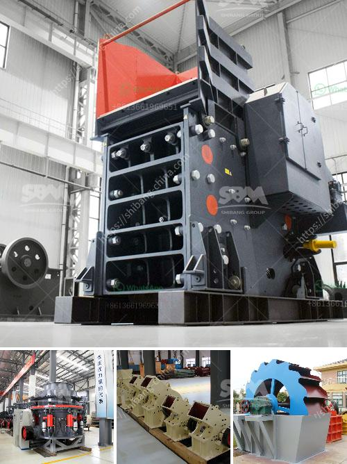

<h3>ball mill suppliers in hyderabad</h3>
Ball mills are used for grinding or mixing materials into small particles. The usage of ball mills is immense in the industrial sector, especially in the mining industry. These machines are primarily used for smashing big rocks into small rocks, gravel, or powder that can be used for various purposes.

In Hyderabad, there are renowned suppliers of ball mills in the market. They provide highly efficient mills with advanced technology, which ensures maximum productivity and minimal downtime. The ball mills offered by these suppliers are robustly constructed, ensuring long-lasting performance. They are made using high-quality materials that can withstand the rigors of heavy-duty operations. The suppliers in Hyderabad also provide customization options, allowing customers to choose the size, capacity, and specifications of the ball mills based on their specific needs.

Ball mill suppliers in Hyderabad not only have a large inventory of mills but also offer various types of mills including planetary ball mills, ceramic ball mills, and continuous ball mills. These mills are known for their high grinding efficiency and ease of operation. The planetary ball mills are popular for their ability to pulverize materials into fine particles, while the ceramic ball mills are preferred for their durability and resistance to corrosion. The continuous ball mills, on the other hand, are widely used due to their continuous operation and high productivity.

Apart from supplying high-quality ball mills, the suppliers in Hyderabad also offer excellent after-sales services. They have a team of experienced technicians who can provide prompt assistance and support, ensuring that the mills are functioning optimally at all times. The suppliers also stock a wide range of spare parts and accessories, making it convenient for customers to procure any necessary replacements or upgrades.

In conclusion, if you are in need of ball mills in Hyderabad, there are several reputable suppliers in the market. These suppliers offer a wide range of ball mills that cater to various industrial needs. With their high-quality products and exceptional after-sales services, they have earned a good reputation among customers. So, whether you need a planetary ball mill, ceramic ball mill, or continuous ball mill, you can rely on these suppliers to fulfill your requirements.
<h3>Contact us</h3><ul><li><strong>Whatsapp:&nbsp;<a href="https://wa.me/8613661969651">+8613661969651</a></strong></li><li><a href="https://swt.shibang-china.com/?git&amp;zhl&amp;ball mill suppliers in hyderabad"><strong>Online Service(chat now)</strong></a></li></ul><h3>Related</h3><ul><li><a href='hammer mill prices in zimbabwe.md'>hammer mill prices in zimbabwe</a></li><li><a href='diesel engine stone crusher small for quarry project.md'>diesel engine stone crusher small for quarry project</a></li><li><a href='kokstad grinding mill for sale.md'>kokstad grinding mill for sale</a></li><li><a href='equipment use in the mining of laterite.md'>equipment use in the mining of laterite</a></li><li><a href='gold wash plant for sale in brazil.md'>gold wash plant for sale in brazil</a></li></ul>