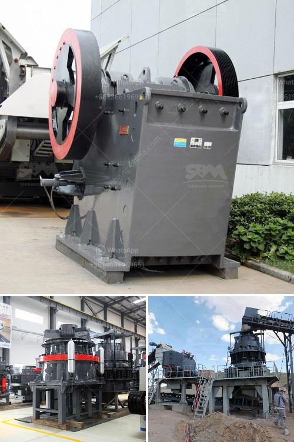

<h3>ball mill to buy in peru</h3>
Peru, a country known for its rich mining industry, relies heavily on the utilization of efficient grinding equipment to extract valuable minerals. Ball mills, widely regarded as essential tools in the mining and manufacturing industries, represent a significant investment for businesses in Peru. In this article, we aim to guide buyers in Peru on how to make an informed decision when purchasing ball mills.

Before delving into the selection process, it is important to understand the fundamentals of a ball mill. A ball mill is a cylindrical device utilized for grinding materials, such as ores, chemicals, and ceramics, in various industries. The rotation of the mill barrel causes the grinding media (balls or rods) to effectively grind the material, creating fine particles.

1. Milling Capacity and Efficiency: The primary aspect to consider when buying a ball mill is its milling capacity. This refers to the amount of material that can be processed within a specific time frame. It is essential to determine the throughput requirements of your operations and choose a ball mill that can handle the desired load. Additionally, consider the mill's efficiency, as it directly impacts the consumption of energy.

2. Grinding Media and Mill Liners: Effective milling relies on the correct selection of grinding media and mill liners. Different materials, such as steel, ceramic, or rubber, can be used as grinding media, depending on the application. Similarly, the choice of mill liners, which protect the mill shell from wear and tear, should be carefully evaluated to ensure longevity and optimal performance.

3. Maintenance and Service: Choosing a ball mill with reliable after-sales support is crucial for uninterrupted operations. Look for suppliers that offer maintenance services, spare parts availability, and training programs to maximize the lifespan and efficiency of your investment.

4. Cost Considerations: Ball mill prices can vary depending on their size, capacity, and additional features. It is important to consider both the immediate upfront cost and the long-term benefits of a well-performing ball mill. Evaluate the overall lifecycle costs, including installation, energy consumption, and maintenance requirements, to determine the best value for your investment.

5. Safety Features: Working with heavy machinery requires strict compliance with safety regulations. Ensure that the chosen ball mill incorporates safety features such as automatic shut-off mechanisms, protective enclosures, and emergency stop buttons. Prioritize the well-being of your workforce by investing in a mill that meets or exceeds industry safety standards.

Choosing the right ball mill is a crucial decision for businesses in Peru's mining and manufacturing sectors. By considering factors such as milling capacity, grinding media, maintenance, cost, and safety, companies can make an informed choice that maximizes production efficiency and ensures a long-lasting investment. As the mining industry continues to evolve, it is vital for buyers to stay ahead by acquiring state-of-the-art grinding equipment that meets their specific requirements.
<h3>Contact us</h3><ul><li><strong>Whatsapp:&nbsp;<a href="https://wa.me/8613661969651">+8613661969651</a></strong></li><li><a href="https://swt.shibang-china.com/?git&amp;zhl&amp;ball mill to buy in peru"><strong>Online Service(chat now)</strong></a></li></ul><h3>Related</h3><ul><li><a href='bentonite processing plant.md'>bentonite processing plant</a></li><li><a href='jaw crusher single toggle.md'>jaw crusher single toggle</a></li><li><a href='manufacturers of coal mill in india.md'>manufacturers of coal mill in india</a></li><li><a href='crusher plant in sargodha.md'>crusher plant in sargodha</a></li><li><a href='project report on concrete crusher pdf.md'>project report on concrete crusher pdf</a></li></ul>