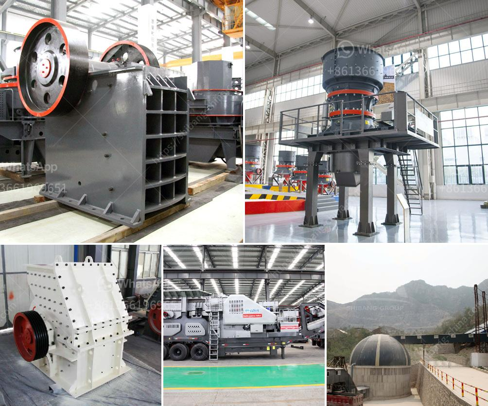

<h3>ball mill to grind quartz</h3>
Ball mill is commonly used to grind quartz in factories. It has advanced structure, reliable operation and high grinding efficiency. It is mainly used in the grinding of quartz products, such as glass, ceramics, metal casting, refractory materials, abrasives, chemicals, building materials and other industries.

The ball mill is composed of a cylinder body, inlet and outlet materials, and grinding media. It rotates around a horizontal axis, and the grinding media are brought to a certain height, and then fall down under the gravity action, crushing and grinding the materials inside the cylinder.

To grind quartz, a ball mill is required. The quartz will be grounded in the ball mill through the grinding process. In the ball mill, quartz is ground to fine powder with the help of grinding media. The grinding media can be different types of balls, ceramic cylinders or rods, and the size and composition of the grinding media vary depending on the application. Generally, 8mm-150mm steel balls or 10mm-90mm ceramic balls are commonly used in the industry.

For efficient grinding of quartz, it is important to choose a suitable grinding mill. The ball mill is widely used due to its simple structure and low energy consumption. It has become a popular choice for grinding materials because of its cost-effective performance.

In conclusion, the ball mill is an essential device in grinding quartz. Its simple structure, reliable operation, and high grinding efficiency make it ideal for grinding various materials, including quartz. Whether used in factories or other industries, the ball mill plays a significant role in the production process. It is a reliable and cost-effective option for grinding quartz and other materials.
<h3>Contact us</h3><ul><li><strong>Whatsapp:&nbsp;<a href="https://wa.me/8613661969651">+8613661969651</a></strong></li><li><a href="https://swt.shibang-china.com/?git&amp;zhl&amp;ball mill to grind quartz"><strong>Online Service(chat now)</strong></a></li></ul><h3>Related</h3><ul><li><a href='cebu rock crusher.md'>cebu rock crusher</a></li><li><a href='mini cement plant for sale in south africa.md'>mini cement plant for sale in south africa</a></li><li><a href='small stone crusher in kenya.md'>small stone crusher in kenya</a></li><li><a href='industrial fine powder grinder.md'>industrial fine powder grinder</a></li><li><a href='sand screening machine philippines.md'>sand screening machine philippines</a></li></ul>