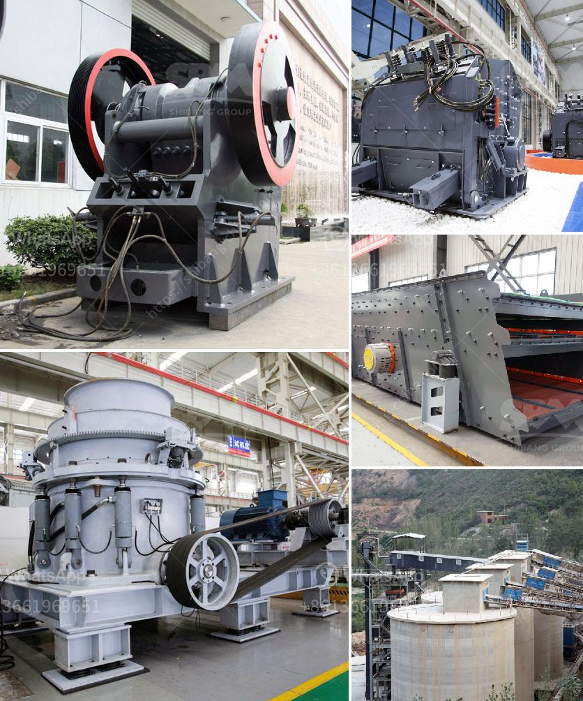

<h3>ball mills for grinding lime</h3>
Ball mills are a common industrial tool that is used to grind materials into a fine powder. They are cylindrical in shape and can range in size from a few inches to several feet in diameter. Ball mills are typically made of steel or ceramic and operate around a horizontal axis.

One common application of ball mills is in the mining industry, where they are used to grind large chunks of raw ore into smaller particles, which are then further processed. In the chemical and cement industries, ball mills are used to grind raw materials, such as limestone and clinker, into a fine powder. This powder is then used as a raw material to produce cement or chemicals.

One specific application of ball mills is in the grinding of lime. Lime is a mineral that is used in various applications, such as wastewater treatment, soil stabilization, and pH control in industries. Lime is typically ground into a fine powder before it is used, and ball mills are often used to achieve this grinding process.

The grinding process in a ball mill involves impact and attrition between the balls and the material being ground. The grinding media in a ball mill can be made of various materials, such as steel, ceramic, or rubber. Ball mills rotate around a horizontal axis, partially filled with the material to be ground and the grinding medium. The balls in the mill grind the material as it rotates, creating a mixture of fine particles and liquid, which eventually forms a slurry.

The grinding process in a ball mill can be controlled through the rotation speed, size of grinding media, and the size of the particles being ground. Ball mills are typically operated at around 75% of critical speed, which ensures that the balls cascade and grind the material progressively. The size of the grinding media in a ball mill can range from small spherical balls to large cylinders or trunnions of approximately the same diameter as the mill.

In the case of grinding lime, ball mills are commonly used due to their ability to grind the material to a fine powder. The size of the grinding media and the rotation speed of the mill can be adjusted to achieve the desired fineness of the ground lime. The resulting lime powder can then be used in various applications, such as in the production of cement, as a soil amendment, or as a pH regulator in industrial processes.

In conclusion, ball mills are versatile industrial tools that are used in various industries for grinding different materials. In the case of grinding lime, ball mills can be highly efficient in achieving the desired fineness of the ground powder. These mills operate through a combination of impact and attrition, resulting in the breakdown of particles into fine powder. As technology continues to advance, ball mills are constantly being improved, making them even more effective in grinding lime and other materials.
<h3>Contact us</h3><ul><li><strong>Whatsapp:&nbsp;<a href="https://wa.me/8613661969651">+8613661969651</a></strong></li><li><a href="https://swt.shibang-china.com/?git&amp;zhl&amp;ball mills for grinding lime"><strong>Online Service(chat now)</strong></a></li></ul><h3>Related</h3><ul><li><a href='jaw crusher with protection.md'>jaw crusher with protection</a></li><li><a href='how many cost in crusher plant in pakistan.md'>how many cost in crusher plant in pakistan</a></li><li><a href='grinding mill machine in greece.md'>grinding mill machine in greece</a></li><li><a href='grinding raymond mill for sale.md'>grinding raymond mill for sale</a></li><li><a href='complete gravel production line.md'>complete gravel production line</a></li></ul>