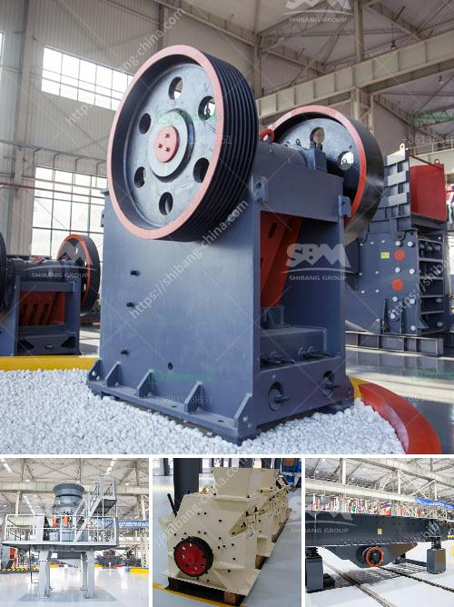

<h3>ball mills for grinding zircon sand</h3>
Ball mills are an essential piece of equipment in the mining and grinding industries, providing a reliable and effective method for grinding and blending materials into a fine powder.

The ball mill is a cylindrical device that uses steel balls as grinding media in a rotating cylindrical chamber. The balls are made of stainless steel or rubber to act as grinding medium. When the ball mill rotates, the balls grind the material in the chamber and produce a fine powder that is ready for further processing.

Zircon sand is a naturally occurring mineral that is commonly used in ceramics, refractory material, and foundry molds. Its high melting point and resistance to chemical corrosion make it ideal for these applications. However, before zircon sand can be used in these applications, it must be ground finely to ensure uniformity and optimal performance.

The grinding process in a ball mill involves removing impurities such as iron and other metal ions from the zircon sand before it is used in the final product. The process involves washing the sand in a dilute acid solution, grinding it in a ball mill to produce a powder, sieving it to remove any remaining impurities, and then drying it.

The size of the grinding media used in the ball mill depends on the particle size of the material being processed. For example, larger particles require larger grinding media to break them down into smaller particles for further processing. The grinding media may be made of steel, ceramic, or rubber, depending on the hardness and abrasiveness of the material being processed.

In addition to grinding zircon sand, ball mills are also used in the mining industry to grind ores such as iron, gold, and copper. Using a ball mill for grinding and blending materials is an efficient and cost-effective method for reducing particles down to the nanometer range.

Ball mills are often used in high-energy milling applications, where mechanical alloying is required to produce alloys of high purity and strength. They are also commonly used in the manufacturing of cement and mineral processing industries.

Overall, ball mills offer a reliable and efficient method for grinding and blending materials into a fine powder. They are essential tools in the mining and grinding industries, enabling the production of high-quality materials for various applications. For grinding zircon sand, the use of a ball mill is recommended and should be considered as a crucial investment.
<h3>Contact us</h3><ul><li><strong>Whatsapp:&nbsp;<a href="https://wa.me/8613661969651">+8613661969651</a></strong></li><li><a href="https://swt.shibang-china.com/?git&amp;zhl&amp;ball mills for grinding zircon sand"><strong>Online Service(chat now)</strong></a></li></ul><h3>Related</h3><ul><li><a href='trapizium mill for purvelising.md'>trapizium mill for purvelising</a></li><li><a href='gold mining equipments africa.md'>gold mining equipments africa</a></li><li><a href='crushing plant philippines.md'>crushing plant philippines</a></li><li><a href='breaker crusher used for coal crushing.md'>breaker crusher used for coal crushing</a></li><li><a href='vertical cement grinding mill from 10 20 tph.md'>vertical cement grinding mill from 10 20 tph</a></li></ul>