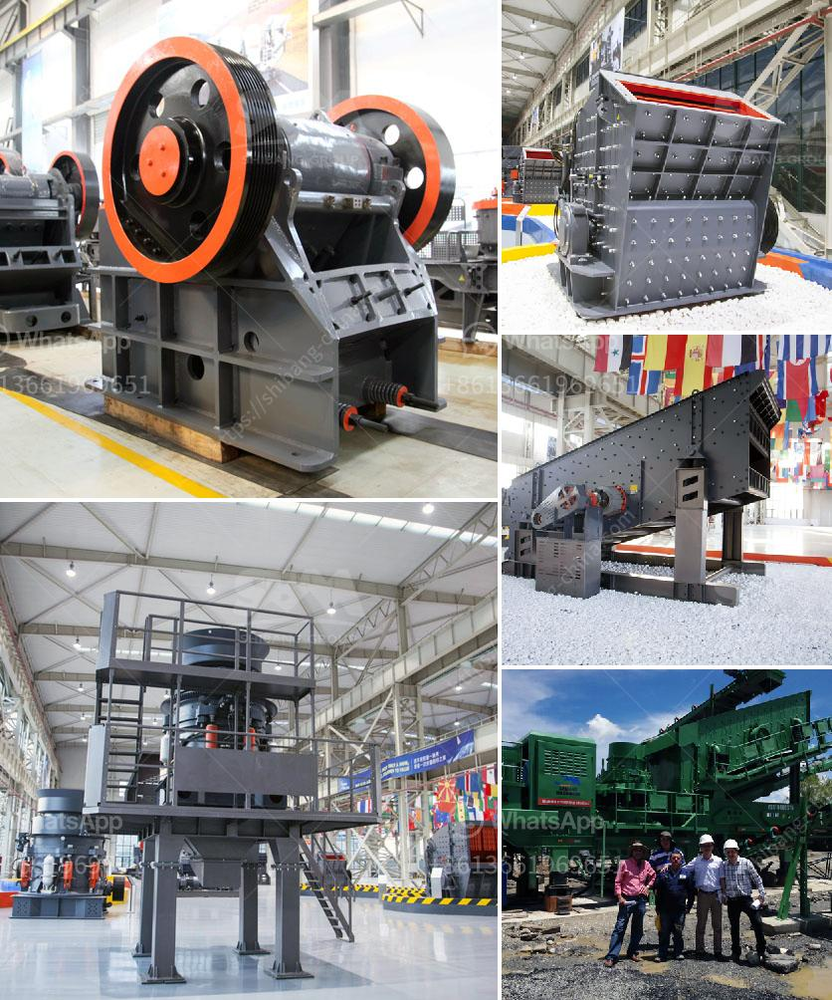

<h3>ball mills for large mining</h3>
Ball mills are a vital tool for mining and ore processing. These machines help grind and mix materials for use in various industries, such as mining and construction. The ball mill uses these balls made of heavy-duty metal that grind down the material you feed into it to give you the desired output size. The installation, maintenance, and repair are quite simple if you closely follow the provided guidelines.

Ball mills for mining operations are designed based on the ore properties. These mills are cylindrical in shape and require heavy-duty materials to grind the ore efficiently and effectively. Ball mills are popular for their simple operational principle. Since they rely on impact and attrition, the ore is reduced for further processing or for direct use in construction materials.

Large mining operations often require ball mills due to the increasing demands for grinding materials. These mills are essential for mining industries because they create the necessary product for downstream processes. Despite their critical role in the industry, the maintenance and operation of ball mills are often neglected. Welds and junctions, for example, need to be inspected regularly in order to detect any cracks or weaknesses. Frequent checks ensure that the mill remains operational and guarantees its efficiency. Additionally, the lubrication system must be well-maintained to prevent overheating and wear of the moving parts. Proper lubrication will also prevent the entry of dust and other contaminants into the bearing assembly.

Ball mills are often used in conjunction with other processing units such as screens, spiral classifiers, cyclones, and flotation cells to separate and concentrate the valuable minerals. To effectively achieve the desired grind size, the ball mill must be operated in a closed circuit system. This allows the particles to be crushed and ground to the desired size before being sent to the next unit operation.

In recent years, the demand for ball mills in the mining industry has grown exponentially. However, with this increased demand comes the need for machines with larger processing capacities. To accommodate this requirement, ball mills for large mining are becoming more common. These mills are often larger in size, which allows them to process more material efficiently. Additionally, they are often equipped with more powerful motors and transmission systems to handle the increased workload.

In conclusion, ball mills are a crucial equipment for mining and ore processing, providing an efficient grinding method that reduces materials down to the desired size. Ball mills for large mining operations are designed to cope with the increasing demands for mining materials and accommodate higher processing capacities. This article explores the basic maintenance and operation practices that can be employed to maximize the lifespan and efficiency of ball mills in large mining operations.
<h3>Contact us</h3><ul><li><strong>Whatsapp:&nbsp;<a href="https://wa.me/8613661969651">+8613661969651</a></strong></li><li><a href="https://swt.shibang-china.com/?git&amp;zhl&amp;ball mills for large mining"><strong>Online Service(chat now)</strong></a></li></ul><h3>Related</h3><ul><li><a href='price jaw crusher price stone crusher.md'>price jaw crusher price stone crusher</a></li><li><a href='cost of cement manufacturing plant.md'>cost of cement manufacturing plant</a></li><li><a href='rock crusher distributors in phillipinwes.md'>rock crusher distributors in phillipinwes</a></li><li><a href='stone crusher machine price in uganda.md'>stone crusher machine price in uganda</a></li><li><a href='cebu rock crusher.md'>cebu rock crusher</a></li></ul>