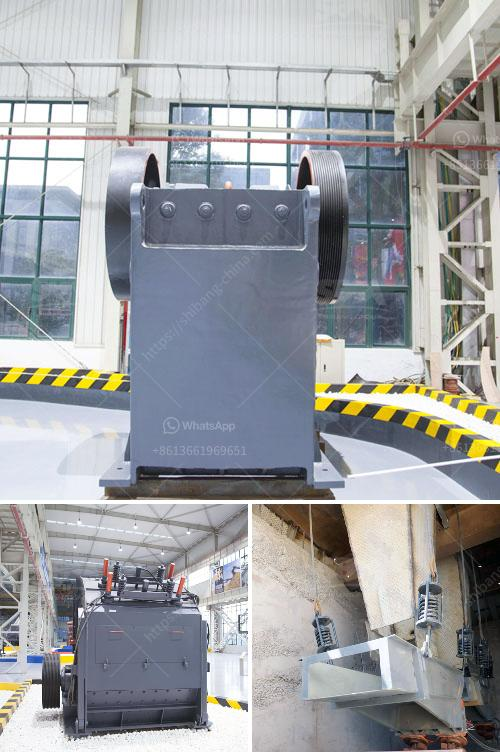

<h3>ballast crusher sale kenya</h3>
The ballast crusher is a machine designed to crush and recycle ballast material, especially for railway ballast, which has the advantage of large production volume, high efficiency, and easy operation. Ballast crusher is used to process stones into small pieces, which is widely used in road, railway, highway, driveways, walking paths, etc. It is well received in Kenya.

There are several reasons why customers in Kenya choose ballast crushers. First, it is wide application and clear specification of products. Secondly, ballast crusher is cheap compared to other traditional crushing equipment. Thirdly, cheap labor and skilled technicians are abundant in Kenya. Therefore, ballast crusher is suitable for customers in Kenya.

The ballast crusher machine has the characteristics of simple structure, easy maintenance, long service life, stable performance, convenient operation and high strength. The crushed stone has good shape, uniform particle size, and can be adjusted according to customer needs. The ballast crusher can be equipped with different crushing cavity types according to customer requirements, which significantly improves the crushing efficiency.

The ballast crusher machine for sale in Kenya is suitable for both stationary and mobile crushing process. It is widely used in stone material processing industry, such as ore mining, cement plant, building material, highway, railway, water conservancy, and chemical industry. etc.

When buying ballast crushers, customers should first consider the production requirements, project scale, and investment budget. They should also consider the specific specifications of the product, the size of the discharge port, and the equipment after-sales service. It is recommended to choose a reliable manufacturer with good reputation, comprehensive service, and high-quality products.

SBM is a well-known crushing equipment manufacturer in China and has been focusing on the development and production of mobile crushing plant for over 30 years. We have passed the ISO9001:2000 international quality management system certification and CE certification. Our crushers have been exported to more than 120 countries and regions, such as Africa, Southeast Asia, Eastern Europe, Middle East, etc. Our ballast crushers have been well received by customers in Kenya.

Ballast crusher is an essential equipment in Kenya's infrastructure projects. With the development of Kenya's economy, many projects need to be built. Therefore, the ballast crusher is in great demand in Kenya. In recent years, railway investment has been gradually increased, especially the construction of high-speed railway. This has brought great opportunities for ballast crusher manufacturers. With the support of national policies and the improvement of infrastructure construction, the ballast crusher industry will flourish in Kenya.
<h3>Contact us</h3><ul><li><strong>Whatsapp:&nbsp;<a href="https://wa.me/8613661969651">+8613661969651</a></strong></li><li><a href="https://swt.shibang-china.com/?git&amp;zhl&amp;ballast crusher sale kenya"><strong>Online Service(chat now)</strong></a></li></ul><h3>Related</h3><ul><li><a href='100tph stationery stone crushing plant.md'>100tph stationery stone crushing plant</a></li><li><a href='stone crushing plant cost in pakistan.md'>stone crushing plant cost in pakistan</a></li><li><a href='vertical mill coal.md'>vertical mill coal</a></li><li><a href='kenya regular impact crusher.md'>kenya regular impact crusher</a></li><li><a href='silica quartz grinding plants bangalore.md'>silica quartz grinding plants bangalore</a></li></ul>