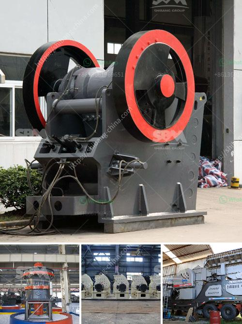

<h3>balls for ball mill in india</h3>
The recovery of valuable minerals from ores has been a game-changer in the mining industry. With advancements in technology, the mining industry has witnessed improvements in extraction methods. One such technology that has revolutionized the mining industry is the ball mill. A ball mill is a cylindrical grinding machine that rotates around a horizontal axis and is partially filled with the material to be ground, along with the grinding medium.

In India, the demand for ball mills is driven by the need for finely ground mineral products in various industries. The rapid growth in the cement industry, for instance, has heavily relied on the use of ball mills. In addition to grinding minerals down, a ball mill also aids in pelletizing minerals. With the increasing demand for minerals globally, ball mills have become an essential tool for Indian manufacturers to meet these demands.

One of the key components of a ball mill is the grinding ball. It is a cylindrical steel ball, varying in sizes that are predominantly used in ball mill operations in India. Many suppliers in India offer high-quality ball mill balls at competitive prices. To ascertain the credibility of the ball mill balls, buyers must look for the following:

1. Material quality: The grinding balls should be made of durable materials like stainless steel or chrome steel. These materials offer excellent corrosion resistance and high wear resistance, ensuring long-lasting performance.

2. Hardness: The hardness of the grinding balls directly affects the efficiency of the milling process. It is crucial to ensure that the ball mill balls have adequate hardness to withstand the impact and wear during grinding operations.

3. Size and shape: The size and shape of the grinding balls significantly impact the performance of the ball mill. Manufacturers in India typically offer grinding balls in various sizes to cater to different milling requirements.

4. Heat treatment: Proper heat treatment of the grinding balls is vital to enhance their hardness and wear resistance. Manufacturers should ensure that the grinding balls have undergone the necessary heat treatment processes, such as quenching and tempering, to optimize their performance.

In India, ball mill suppliers understand the importance of providing high-quality grinding balls for ball mills. They employ advanced manufacturing processes to produce grinding balls that meet stringent quality standards. These manufacturers also conduct thorough quality checks to ensure consistent performance of their products.

The availability of reliable suppliers offering high-quality grinding balls has significantly benefited the mining industry in India. The use of ball mills for grinding and pelletizing minerals has led to increased efficiency, productivity, and cost savings for Indian manufacturers. Moreover, the fine grinding capabilities of ball mills have resulted in the production of finer mineral products, contributing to the overall growth of various industries.

In conclusion, ball mills have emerged as a crucial tool for mineral processing in India. The availability of high-quality grinding balls has further fueled the demand for ball mills in the country. With advancements in manufacturing techniques, Indian suppliers are capable of meeting the diverse needs of the mining industry. As the mining sector continues to flourish, the ball mill's role in India's mining industry is only set to strengthen further.
<h3>Contact us</h3><ul><li><strong>Whatsapp:&nbsp;<a href="https://wa.me/8613661969651">+8613661969651</a></strong></li><li><a href="https://swt.shibang-china.com/?git&amp;zhl&amp;balls for ball mill in india"><strong>Online Service(chat now)</strong></a></li></ul><h3>Related</h3><ul><li><a href='barite jaw crusher manufacturing companies.md'>barite jaw crusher manufacturing companies</a></li><li><a href='vertical horizontal milling machine.md'>vertical horizontal milling machine</a></li><li><a href='jaw crushers price south africa.md'>jaw crushers price south africa</a></li><li><a href='mobile crusher seller.md'>mobile crusher seller</a></li><li><a href='for sale mobile crusher.md'>for sale mobile crusher</a></li></ul>