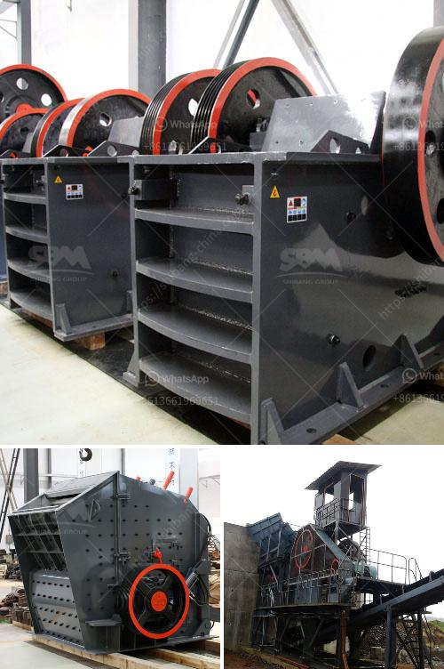

<h3>balls in cement grinding</h3>
Cement grinding is a crucial stage in the production process in which fine particles of cement are created by grinding clinker, a mixture of cement ingredients found in a rotary kiln, with the addition of gypsum and pozzolanic materials. This grinding process utilizes various types of equipment, including ball mills, which are mills filled with steel or ceramic balls that grind the clinker to fine powder.

The use of balls in cement grinding has proven to be an effective and efficient method for achieving the desired particle size distribution and enhancing the overall quality of the final product. The balls are designed to withstand high levels of impact and abrasion, ensuring durability and longevity in the grinding process.

One of the key advantages of using balls in cement grinding is their ability to reduce particle size efficiently. As the clinker is crushed between the balls and the mill's inner lining, it undergoes multiple impacts and gets increasingly ground into finer particles. This ensures a more homogeneous distribution of cement particles, contributing to improved strength development and setting time of the final product.

Another benefit of using balls in cement grinding is their ability to enhance the grinding process's energy efficiency. The balls' constant movement inside the mill helps break down clinker particles efficiently, reducing the amount of energy required to grind the material. This results in lower power consumption, contributing to cost savings and environmental sustainability in cement production.

Furthermore, the proper selection and optimization of ball materials can significantly impact the overall quality of cement. Steel balls, for example, are commonly used in cement grinding due to their high hardness and wear resistance. However, ceramic balls, which offer superior wear resistance compared to steel, are gaining popularity in recent years. Their smoother surface minimizes ore particle adherence, reducing material build-up and potential contamination. This results in a cleaner and higher-quality cement product.

It is worth noting that the use of balls in cement grinding requires proper monitoring and maintenance to ensure optimal performance. Regular inspections of the ball mill's condition, including the proper alignment of balls, as well as regular ball charge re-optimization, are essential to maintain efficiency and prevent operational issues, such as liner wear and ball breakage.

In conclusion, using balls in cement grinding plays a crucial role in enhancing efficiency and improving the quality of the final product. The constant impact and grinding action of the balls significantly reduce particle size and improve particle distribution, leading to better cement performance. Moreover, the choice of ball materials, such as steel or ceramics, can further enhance wear resistance, minimize contamination, and produce a cleaner cement product. Regular monitoring and maintenance of the grinding process are important to sustain these benefits and optimize mill performance. As cement production continues to evolve, the use of balls in grinding remains an essential tool for achieving optimal results.
<h3>Contact us</h3><ul><li><strong>Whatsapp:&nbsp;<a href="https://wa.me/8613661969651">+8613661969651</a></strong></li><li><a href="https://swt.shibang-china.com/?git&amp;zhl&amp;balls in cement grinding"><strong>Online Service(chat now)</strong></a></li></ul><h3>Related</h3><ul><li><a href='crusher plant for sale.md'>crusher plant for sale</a></li><li><a href='fuller traylor nt gyratory crusher manual.md'>fuller traylor nt gyratory crusher manual</a></li><li><a href='aggregate production line.md'>aggregate production line</a></li><li><a href='price of roller crusher.md'>price of roller crusher</a></li><li><a href='different type of grinding mills.md'>different type of grinding mills</a></li></ul>