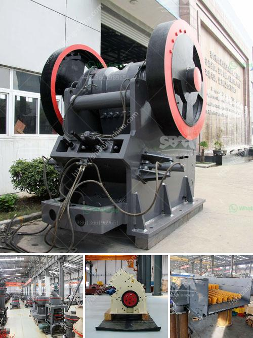

<h3>balls mill for limestone</h3>
Limestone is a sedimentary rock formed mainly in marine environments, which has undergone extensive geological changes over millions of years. It is formed from the accumulation of minerals such as calcite and aragonite, which are the main components of limestone deposits. The high calcium content of limestone makes it a valuable material, particularly in construction and industrial applications.

One of the key processes used in limestone production is limestone grinding. Grinding is the process where the limestone is reduced into a fine powder to facilitate its further usage. These powdered limestone particles are then used in various applications such as cement, mortar, soil conditioner, and concrete additives.

To achieve the desired fineness of limestone powder, a grinding mill is required. Traditionally, the most common approach in the industry has been to use ball mills, which are effective at grinding limestone to a specific fineness. However, ball mills require a high capital investment and energy consumption, thus impacting overall profitability.

Balls mills for limestone have proven to be a more effective element for grinding limestone in recent years. The theoretical calculations undertaken by researchers have shown long-term performance reliability of this type of grinding system. The initial cost of installation and maintenance, coupled with the cost of grinding media, make this alternative an attractive investment.

The limestone grinding system that incorporates the balls mill is a reliable choice for grinding limestone in various industries. As the manufacturer holding the very first hammer mill patent to utilize mid-air impact crushing, Williams takes great pride in providing quality, rugged machines for many applications.

The balls mill technology is one of the most commonly preferred types of grinding equipment in limestone grinding applications. The chamber "vortex" consists of a rotor with multiple numbers of grinding path. The grinding media is moved by the action of the rotating rotor, accumulating energy and moving the media at different velocities. This results in highly efficient grinding and a finer product size distribution.

The smaller footprint and lower weight of balls mills make them easier to install and maintain. Additionally, their energy-efficient design helps in reducing operational costs. The balls mill is suitable for both dry and wet grinding of limestone, including cylindrical and conical end mills, and it can handle a range of capacities as per the specific requirements of the application.

In conclusion, balls mill for limestone grinding is a crucial tool for comminution and grinding applications in limestone quarry operations. Properly utilized, the balls mill can be an effective way to reduce energy consumption, conserve resources, and optimize profits – all while delivering effective results in the most demanding limestone processing applications.
<h3>Contact us</h3><ul><li><strong>Whatsapp:&nbsp;<a href="https://wa.me/8613661969651">+8613661969651</a></strong></li><li><a href="https://swt.shibang-china.com/?git&amp;zhl&amp;balls mill for limestone"><strong>Online Service(chat now)</strong></a></li></ul><h3>Related</h3><ul><li><a href='canada gold mining equipment manufacturers.md'>canada gold mining equipment manufacturers</a></li><li><a href='stone cracher mechine manufacturer.md'>stone cracher mechine manufacturer</a></li><li><a href='crusehr processing plant malaysia.md'>crusehr processing plant malaysia</a></li><li><a href='cement clinker grinding plant for sale in india.md'>cement clinker grinding plant for sale in india</a></li><li><a href='18tph roll mill process.md'>18tph roll mill process</a></li></ul>