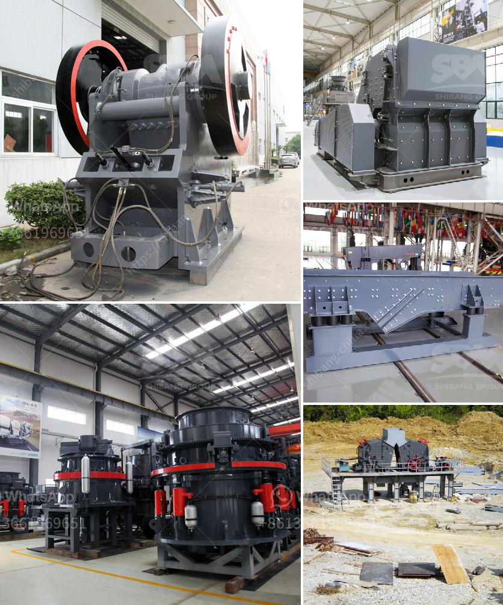

<h3>barite crusher machine</h3>
Barite, also known as baryte, is a mineral composed of barium sulfate (BaSO4). It is usually colorless or milky white, but can also be found in various shades of blue, yellow, or brown. Barite is often used as a weighting agent in drilling fluids in the oil and gas industry due to its high specific gravity.

In order to process barite into powder, the barite crusher machine is indispensable. Fote Machinery offers various types and models of barite crushing machines for sale, such as PE jaw crusher, PEX jaw crusher, PF impact crusher, PC hammer crusher, and the latest generation of vertical impact crusher.

Barite crusher machine refers to the crushing machine used to make large barite particles into smaller ones. Fote Machinery can provide various kinds of crushing and grinding machines for barite ore processing, such as jaw crusher, cone crusher, hammer crusher, ball mill, and so on. For barite processing, Fote Machinery can not only provide users with a reasonable barite crusher price, but also provide detailed installation and maintenance guidance.

In addition, Fote Machinery has rich experience in barite processing. It is worth mentioning that Fote Machinery has a good reputation among customers with its barite crusher machine. Fote Machinery is committed to providing the best products and services for customers, and taking customer satisfaction as its responsibility. With its high-quality products and excellent after-sales service, Fote Machinery has won the trust and support of many customers.

To sum up, the barite crusher machine is a reliable and efficient crushing equipment. It can effectively crush the barite material into required sizes. With wide application ranges, barite crusher machines have been widely used in various stone processing plants or grinding mills in mining industry. The barite crusher machines are of high quality and reasonable price, and have been exported to many countries such as Vietnam, Kazakhstan, Turkey, Saudi Arabia, and other Middle Eastern countries.
<h3>Contact us</h3><ul><li><strong>Whatsapp:&nbsp;<a href="https://wa.me/8613661969651">+8613661969651</a></strong></li><li><a href="https://swt.shibang-china.com/?git&amp;zhl&amp;barite crusher machine"><strong>Online Service(chat now)</strong></a></li></ul><h3>Related</h3><ul><li><a href='river sand and stone mining at sabah.md'>river sand and stone mining at sabah</a></li><li><a href='raymond mill india price.md'>raymond mill india price</a></li><li><a href='china portable jaw crusher plant manufacturers china.md'>china portable jaw crusher plant manufacturers china</a></li><li><a href='3 roller raymond mill delhi.md'>3 roller raymond mill delhi</a></li><li><a href='stone crushing machines in uk.md'>stone crushing machines in uk</a></li></ul>