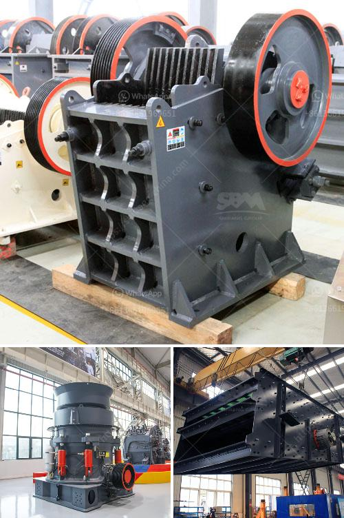

<h3>barite jaw crusher manufacturing companies</h3>
Barite is a mineral that is considered an essential raw material in various industries, including oil and gas exploration, drilling, and production. It is primarily used as a weighting agent in drilling mud to control formation pressure and prevent blowouts. Due to its high specific gravity and chemical inertness, barite is the preferred choice in these applications. As a result, the demand for barite has been increasing, leading to a surge in the manufacturing of barite jaw crushers.

Barite jaw crushers are essential crushing equipment for barite crushing. With the increasing demand for barite, the market for barite jaw crushers is booming. Manufacturers can produce various types of barite jaw crushers by different models, configurations, and specifications.

As one of the main manufacturers of barite jaw crushers in the world, we have various models of barite jaw crushers for sale. Our jaw crushers can satisfy different requirements in different applications. The barite jaw crusher is a crushing machine that is mainly used for medium-sized crushing of various ores and bulk materials. It can crush materials with force up to 320MPa, compressive strength. It is widely used in many industries, such as mining, metallurgy, building materials, road, railway, water conservancy and chemical industry.

In the manufacturing process, strict quality control measures are implemented to ensure the reliability and durability of the barite jaw crusher. Each component is carefully designed, engineered, and tested to ensure optimal performance and longevity. Advanced manufacturing techniques are employed to enhance the structural integrity and efficiency of the jaw crusher. Furthermore, our manufacturing process adheres to international standards and industry best practices. This ensures that our barite jaw crushers are safe, reliable, and high-performing.

In addition to manufacturing high-quality barite jaw crushers, we also provide comprehensive customer support services. Our team of experienced engineers and technicians is available to assist customers in selecting the right jaw crusher for their specific requirements. We offer customized solutions tailored to the unique needs of each customer. Additionally, we provide on-site installation, operation training, and after-sales support to ensure the smooth operation of the barite jaw crushers.

To stay competitive in the market, we continuously invest in research and development to improve the performance and efficiency of our barite jaw crushers. We strive to innovate and introduce new features and technologies that can further enhance the productivity and reliability of our jaw crushers.

In conclusion, the manufacturing of barite jaw crushers is a growing industry. As the demand for barite continues to rise, manufacturers are developing high-quality crushers to meet the diverse needs of customers. With reliable performance, comprehensive support, and continuous innovation, barite jaw crushers are becoming an essential tool in various industries.
<h3>Contact us</h3><ul><li><strong>Whatsapp:&nbsp;<a href="https://wa.me/8613661969651">+8613661969651</a></strong></li><li><a href="https://swt.shibang-china.com/?git&amp;zhl&amp;barite jaw crusher manufacturing companies"><strong>Online Service(chat now)</strong></a></li></ul><h3>Related</h3><ul><li><a href='conveyor belts manufacturers south africa.md'>conveyor belts manufacturers south africa</a></li><li><a href='mobile stone crusher price india.md'>mobile stone crusher price india</a></li><li><a href='calcium bromide manufacturing process.md'>calcium bromide manufacturing process</a></li><li><a href='tracked jaw crusher for sale.md'>tracked jaw crusher for sale</a></li><li><a href='cost of cement manufacturing plant.md'>cost of cement manufacturing plant</a></li></ul>