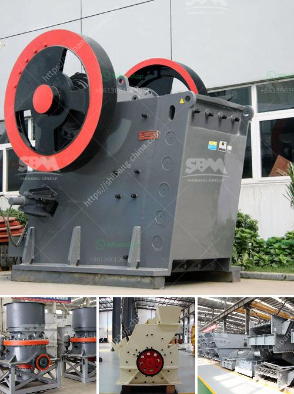

<h3>barite rock mill</h3>
Barite, also known as baryte, is a naturally occurring mineral found in various parts of the world. It has a high density and is resistant to chemical and physical weathering, making it a valuable mineral in various industries. One of the most prominent applications of barite is in the oil and gas industry, where it is used as a weighting agent in drilling fluids.

Barite rock mills play a crucial role in the production of barite powder used in drilling fluids. These mills grind barite ore into powders of the desired size, which is then mixed with other additives to form drilling fluids with specific properties. The use of barite powder in drilling fluids helps to control formation pressure, lubricate the drill bit, and prevent blowouts, making it an indispensable component in the drilling process.

One of the key advantages of using barite rock mills is their ability to produce a consistent and uniform powder size distribution. This ensures the desired properties of the drilling fluids, such as rheology and fluid loss control, are achieved. The grinding process in these mills involves crushing and grinding the barite ore to a specific size, followed by classification to separate the fine and coarse particles. The resulting powder is then packaged and transported to drilling sites for use.

In addition to the oil and gas industry, barite rock mills find applications in other sectors as well. The chemical industry utilizes barite powder as a filler in the production of paints, plastics, and rubber, enhancing their properties, such as durability and electrical resistance. Moreover, barite powder is employed in the production of barium carbonate, a key ingredient in the manufacturing of ceramic glazes, glass, and various construction materials.

Furthermore, barite rock mills contribute to sustainable mining practices. The extraction and processing of barite ore involve minimal environmental impact due to its relatively low toxicity and inert nature. Additionally, barite rock mills employ advanced technologies such as energy-efficient grinding systems and dust control mechanisms, further reducing their environmental footprint.

However, despite its numerous applications and benefits, the barite industry faces challenges. Volatility in oil prices affects the demand for barite powder, as drilling activities and exploration are often tied to the profitability of the oil and gas sector. Moreover, the availability of high-quality barite ore and environmental regulations pose challenges to the growth of the industry.

To overcome these challenges, the barite industry is continuously investing in research and development to improve the efficiency and sustainability of barite rock mills. Innovations include the development of new grinding systems that reduce energy consumption, the utilization of waste materials as additives, and the adoption of water recycling technologies.

In conclusion, barite rock mills play a vital role in the production of barite powder used in drilling fluids and other industries. Their ability to produce consistent and uniform powder size distribution ensures the desired properties of the end products. Moreover, barite rock mills contribute to sustainable mining practices and employ advanced technologies to reduce environmental impact. While the industry faces challenges, continuous investments in research and development will pave the way for a thriving barite industry in the future.
<h3>Contact us</h3><ul><li><strong>Whatsapp:&nbsp;<a href="https://wa.me/8613661969651">+8613661969651</a></strong></li><li><a href="https://swt.shibang-china.com/?git&amp;zhl&amp;barite rock mill"><strong>Online Service(chat now)</strong></a></li></ul><h3>Related</h3><ul><li><a href='equipment for the production of vermiculite.md'>equipment for the production of vermiculite</a></li><li><a href='ball mill to buy in peru.md'>ball mill to buy in peru</a></li><li><a href='malaysia stone crusher price.md'>malaysia stone crusher price</a></li><li><a href='cost of starting a small gold mine zimbabwe.md'>cost of starting a small gold mine zimbabwe</a></li><li><a href='ball mill price mexico.md'>ball mill price mexico</a></li></ul>