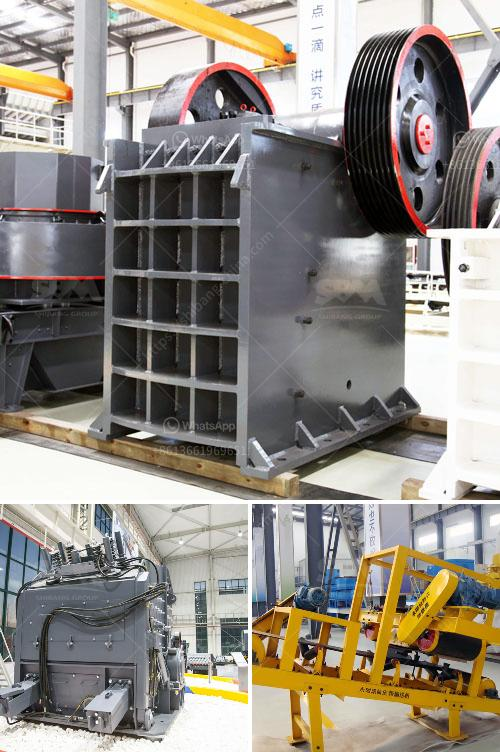

<h3>basalt crusher machine</h3>
Basalt is a volcanic rock that can be found in various regions around the world. Basalt is mainly used as an aggregate for construction purposes, such as concrete and asphalt. It is also used in road construction, as railway ballast, and as a material for various other applications in the construction industry.

One of the primary machines used in the mining and construction industry is the basalt crusher machine. This machine is a very powerful tool for breaking down large rocks into smaller ones or gravels for various construction purposes. The basalt crusher machine comes in various types and specifications, ranging from stationary to mobile, to cater to different industries' needs.

The primary purpose of the basalt crusher machine is to reduce large-sized stones or rocks into smaller pieces. These smaller pieces can then be used as raw materials for construction projects. The basalt crusher works by gradually applying pressure to the material to break it down. This process is known as crushing.

The basalt crusher machine has various types for different processing conditions, such as jaw crusher, cone crusher, and impact crusher. The basalt crushing process requires the crusher to be operated at appropriate parameters, such as feeding size, capacity, and output size. Besides, the basalt crusher machine must be operated and maintained properly to ensure the long-term operation of the machine.

The basalt crusher machine has unique advantages when compared to other crusher machines. For instance, it has the advantage of having a steeper crushing chamber, which helps to increase the production capacity and output. The basalt crusher machine also has the advantage of producing cubical-shaped end products, which is highly desirable in the construction industry.

Another advantage of using the basalt crusher machine is its versatility. It can be used to process different types of basalt rocks, such as fine-grained basalt, medium-grained basalt, and coarse-grained basalt. This versatility allows the machine to be used in various construction projects, ranging from small-scale projects to large-scale infrastructure projects.

Furthermore, the basalt crusher machine is designed with advanced technology and materials, which makes it highly durable and efficient. This durability ensures that the machine can withstand harsh operating conditions, such as high temperatures and heavy loads, without compromising its performance.

In conclusion, the basalt crusher machine is an essential tool for construction projects. It is designed to efficiently crush and process basalt rocks into smaller pieces, which can then be used as raw materials for various construction purposes. The machine's advantages include its versatility, high production capacity, cubical-shaped end products, and durability. To ensure the machine's long-term operation, it should be operated and maintained properly according to the manufacturer's guidelines. With the basalt crusher machine, construction projects can be completed more efficiently and effectively, leading to the development of robust and sustainable infrastructure.
<h3>Contact us</h3><ul><li><strong>Whatsapp:&nbsp;<a href="https://wa.me/8613661969651">+8613661969651</a></strong></li><li><a href="https://swt.shibang-china.com/?git&amp;zhl&amp;basalt crusher machine"><strong>Online Service(chat now)</strong></a></li></ul><h3>Related</h3><ul><li><a href='silica sand washing dry process.md'>silica sand washing dry process</a></li><li><a href='italy mobile vibrating screen.md'>italy mobile vibrating screen</a></li><li><a href='copper powder making machine.md'>copper powder making machine</a></li><li><a href='malaysia companies that manufacture crushing machines.md'>malaysia companies that manufacture crushing machines</a></li><li><a href='chalcopyrite ore processing plant cost to built and sale.md'>chalcopyrite ore processing plant cost to built and sale</a></li></ul>