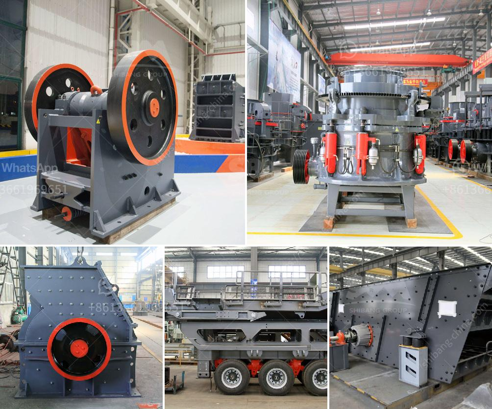

<h3>bauxite crusher machine</h3>
Bauxite is a common material in the world of mining and metallurgy, mainly used in aluminum production. With the rapid development of the industry, the demand for bauxite has increased, leading to more and more methods to obtain it. However, the extraction of bauxite requires a series of crushing and grinding processes, and crusher machines are indispensable equipment in this process.

Bauxite is actually a rock composed mainly of aluminum oxide and aluminum hydroxide minerals. These minerals are primarily found in the form of gibbsite and boehmite, with smaller amounts of diaspore. Bauxite deposits are found in many countries and regions, including Australia, Guinea, Brazil, Jamaica, and India, among others.

To extract aluminum from bauxite, the ore is first crushed and then refined using various methods like the Bayer process or the Hall-Héroult process. The crusher machine plays a significant role in the process of bauxite extraction. Crushing equipment is vital to the production process because it reduces the size of the extracted bauxite ore into smaller particles that can be further processed.

The bauxite crusher machine is designed with a double-feed chamber, so it can suit a wide range of material types and crush them efficiently. The crushing chamber is deep and without a dead zone, which improves the feeding capacity of the machine and prevents material blockage. The machine also has a large crushing ratio, which means that the material can be crushed into finer particles. This can save energy and improve efficiency in the subsequent grinding process.

What sets the bauxite crusher machine apart is its high reliability and robustness. It has been designed to operate in the harshest conditions and withstand the toughest materials. The machine uses a hydraulic system to adjust the size of the discharge opening, which ensures the uniformity of the final product. The machine is also equipped with a simple and convenient maintenance system, making it easier to repair and maintain.

In addition to its high performance and durability, the bauxite crusher machine is also eco-friendly. It produces low noise and little vibration during operation, while the dust and noise pollution is effectively controlled. This ensures a safer and more pleasant working environment for operators.

In conclusion, the bauxite crusher machine is an essential piece of equipment in the bauxite processing process. Its high crushing efficiency and good performance make it widely used in the mining and metallurgy industries. It can crush various materials like bauxite, marble, and limestone, etc., producing different specifications of finished products. Furthermore, its eco-friendly design and low maintenance requirements make it an excellent choice for bauxite crushing operations.
<h3>Contact us</h3><ul><li><strong>Whatsapp:&nbsp;<a href="https://wa.me/8613661969651">+8613661969651</a></strong></li><li><a href="https://swt.shibang-china.com/?git&amp;zhl&amp;bauxite crusher machine"><strong>Online Service(chat now)</strong></a></li></ul><h3>Related</h3><ul><li><a href='jaw crusher price in kenya.md'>jaw crusher price in kenya</a></li><li><a href='georgia country stone crusher.md'>georgia country stone crusher</a></li><li><a href='chilli powder making machine india price.md'>chilli powder making machine india price</a></li><li><a href='application of vertical grinding machine.md'>application of vertical grinding machine</a></li><li><a href='copper crusher machine.md'>copper crusher machine</a></li></ul>