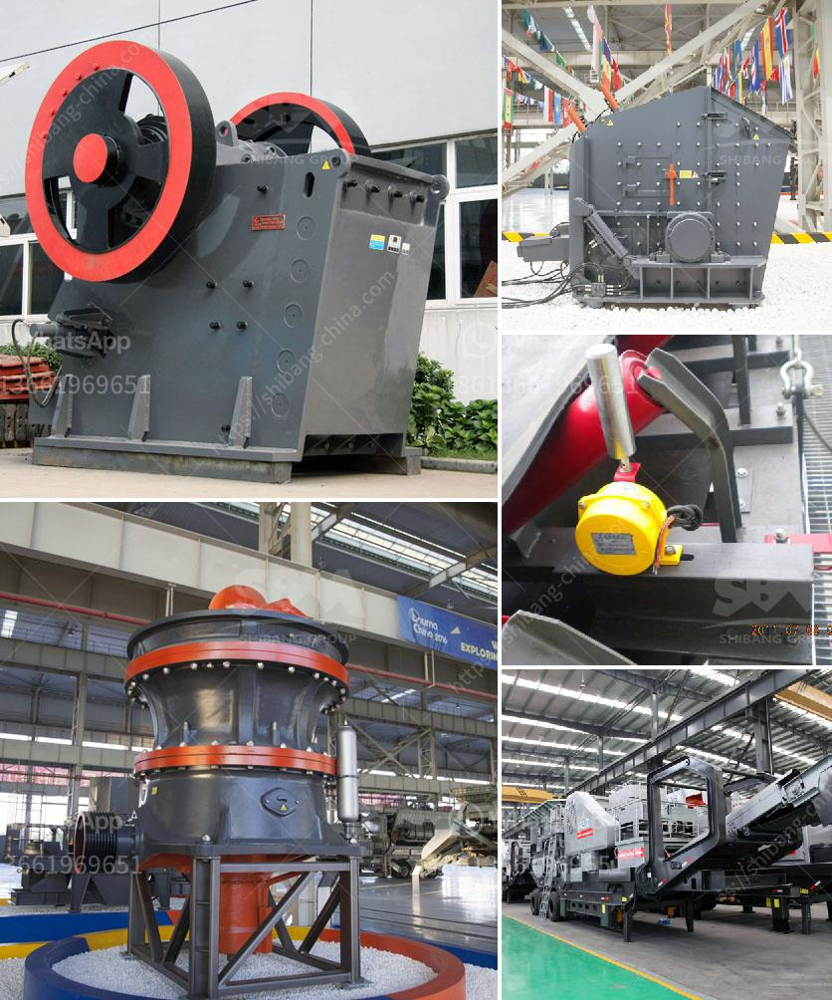

<h3>bauxite processing plant</h3>
Bauxite is a mineral ore that is commercially used in the production of aluminum. It is found in abundance in tropical and sub-tropical regions of the world and is the main source of aluminum for the global industry. Bauxite processing involves the extraction of alumina, which is then used to produce aluminum metal.

A bauxite processing plant is the facility that handles the processing of bauxite, a mineral used to produce aluminum. The plant typically consists of crushers, grinders, washers, dryers, conveyors, and other equipment. The primary purpose of the plant is to extract high-quality alumina from bauxite ore and prepare it for further processing.

The process starts with the crushing and grinding of the bauxite ore. This is done to increase the surface area of the ore for better chemical reactions in the subsequent steps. The crushed ore is then washed and heated in a rotary kiln to remove any impurities or moisture. After this step, the bauxite is ready to be further processed.

The next stage involves extracting alumina from the bauxite ore. This is done through a process called Bayer's process. In this process, the crushed and heated bauxite is mixed with sodium hydroxide solution. This mixture is then passed through multiple stages of settling and filtration to separate impurities and extract alumina. The extracted alumina is then washed, filtered, and calcined to produce the final product.

Once alumina is obtained, it can be further processed to obtain aluminum metal through a process called electrolysis. This involves passing a direct current through a molten mixture of alumina and cryolite. The electric current causes the aluminum to separate from the oxygen and collect at the cathode. The extracted aluminum can then be used in various industries for manufacturing products such as cars, planes, and beverage cans.

Bauxite processing plants play a crucial role in the aluminum production process. They help in extracting alumina from bauxite ore, which is then further processed to produce aluminum metal. Without these plants, the production of aluminum would not be possible on such a large scale. As the demand for aluminum continues to grow, the importance of bauxite processing plants becomes even more significant.
<h3>Contact us</h3><ul><li><strong>Whatsapp:&nbsp;<a href="https://wa.me/8613661969651">+8613661969651</a></strong></li><li><a href="https://swt.shibang-china.com/?git&amp;zhl&amp;bauxite processing plant"><strong>Online Service(chat now)</strong></a></li></ul><h3>Related</h3><ul><li><a href='ball mill in mumbai.md'>ball mill in mumbai</a></li><li><a href='list of cement factories in nepal.md'>list of cement factories in nepal</a></li><li><a href='how much does a quarry machine cost.md'>how much does a quarry machine cost</a></li><li><a href='jaw crusher 50 mt hour for sale.md'>jaw crusher 50 mt hour for sale</a></li><li><a href='gypsum calcining equipment price.md'>gypsum calcining equipment price</a></li></ul>