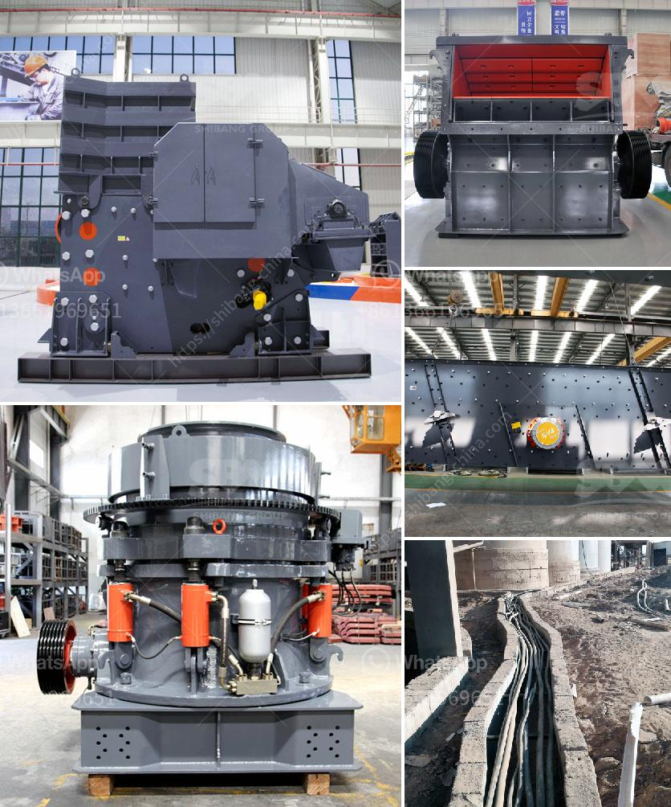

<h3>belt conveyor for coal design in india</h3>
Belt conveyors are the heart of the coal mining operations. In the coal mining industry in India, the design of the conveyor systems has become a crucial factor in mining operations. Conveyors are the prime means of transferring coal from the mine to the power plant or to the stockyard in a coal-fired thermal power plant.

The conventional design of a belt conveyor system usually comprises of a single belt running on idlers or pulleys. These conveyors have a flat carrying surface ideal for handling loose materials such as coal. The belt is supported by a series of rollers and is driven by a motor through a gearbox.

When designing a belt conveyor for coal in India, it is essential to consider several factors to ensure that the conveyor offers maximum efficiency and reliability. The design parameters include the capacity of the conveyor, the belt width, the speed of the belt, the incline angle of the conveyor, the type and size of the pulleys, the materials used for the belt and the idlers, and the power requirements.

The capacity of the conveyor system depends on several factors such as the length of the conveyor, the speed of the belt, and the type of coal being transported. The capacity should be designed to handle the peak load conditions and should take into account future expansion plans.

The belt width is chosen based on the size of the coal that needs to be transported. A wider belt allows for a higher volume of coal to be carried, leading to increased productivity. The speed of the belt is selected based on the desired throughput and the material characteristics. A higher belt speed can result in higher capacity but may also lead to increased wear and tear.

The incline angle of the conveyor is an important consideration in the design. Inclined conveyors are commonly used to transport coal from the mine to higher elevations such as a storage facility or a crusher. The angle of incline should be chosen carefully to ensure that the coal does not spill or slide back on the conveyor.

The type and size of pulleys used in the design are crucial for the smooth operation of the conveyor. The pulleys should be selected based on the load and the belt tension. The materials used for the belt and the idlers should be chosen to withstand the harsh conditions of the coal mining environment. The belt material should have high tensile strength and resistance to abrasion.

The power requirements of the conveyor system depend on the length of the conveyor, the size of the motor, and the number of conveyors in the system. The power consumption should be optimized to minimize energy costs and reduce environmental impact. Energy-efficient motors and variable frequency drives can be used to reduce power consumption.

In conclusion, the design of belt conveyors for coal in India plays a crucial role in the efficient and reliable transportation of coal. The design parameters should be carefully considered to ensure maximum capacity, smooth operation, and minimum maintenance requirements. With the right design, belt conveyors can significantly enhance the productivity and profitability of coal mining operations in India.
<h3>Contact us</h3><ul><li><strong>Whatsapp:&nbsp;<a href="https://wa.me/8613661969651">+8613661969651</a></strong></li><li><a href="https://swt.shibang-china.com/?git&amp;zhl&amp;belt conveyor for coal design in india"><strong>Online Service(chat now)</strong></a></li></ul><h3>Related</h3><ul><li><a href='gold mining business plan ghana.md'>gold mining business plan ghana</a></li><li><a href='cost of mini pulvrizers crusher.md'>cost of mini pulvrizers crusher</a></li><li><a href='two roller mill.md'>two roller mill</a></li><li><a href='size of ball mill with cspacity 280 tph.md'>size of ball mill with cspacity 280 tph</a></li><li><a href='gold crusher for sale in china.md'>gold crusher for sale in china</a></li></ul>