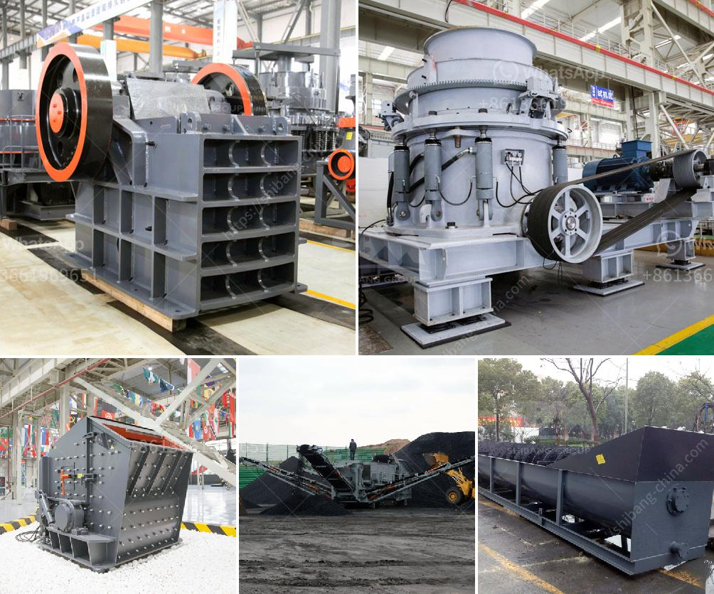

<h3>bentonite clay processing plant</h3>
Bentonite clay is a material derived from the weathering and volcanic ash of volcanic rocks. It has been used for centuries as a natural remedy for various ailments due to its unique properties. However, in recent years, the demand for bentonite clay has skyrocketed due to its applications in various industries such as agriculture, construction, cosmetics, and oil drilling.

To meet this growing demand, bentonite clay processing plants have been established worldwide. These plants involve several stages of processing to transform the raw bentonite clay into various forms such as powders, granules, or pellets, depending on the intended use.

The first stage in the processing of bentonite clay is mining. Bentonite deposits are usually found close to the surface, making them easily accessible for extraction. Miners use heavy machinery to remove the topsoil and expose the clay layer. The clay is then excavated and transported to the processing plant for further treatment.

Once at the processing plant, the clay undergoes various processes to remove impurities and enhance its properties. The first step is drying, which involves spreading the clay on large flat beds and allowing it to dry under the sun. This process removes any excess moisture and prepares the clay for further processing.

The dried clay is then crushed and ground into a fine powder using specialized machinery. This powder is then classified into different grades based on its particle size. The finer the powder, the higher its quality and market value. The classification process ensures the production of consistent and high-quality bentonite clay products.

After classification, the clay powder is often subjected to further treatments to enhance its properties. One common treatment is activation, which involves adding chemicals or heat to improve the clay's adsorption capabilities. Activated bentonite clay is widely used in industries such as oil drilling, as it can effectively absorb and remove impurities from drilling fluids.

Once the processing is complete, the final bentonite clay products are packaged and ready for distribution. These products are used in a variety of applications across different industries. In agriculture, bentonite clay is used as a soil amendment to improve water retention and nutrient availability. In construction, it is used in foundation systems to prevent water seepage. In cosmetics, it is used in face masks and skincare products for its detoxifying and cleansing properties.

In conclusion, bentonite clay processing plants play a crucial role in meeting the growing demand for this versatile material. The various stages of processing, including mining, drying, grinding, and treatment, ensure the production of high-quality bentonite clay products that can be used in a wide range of applications. With the continued growth of industries relying on bentonite clay, the importance of these processing plants cannot be underestimated.
<h3>Contact us</h3><ul><li><strong>Whatsapp:&nbsp;<a href="https://wa.me/8613661969651">+8613661969651</a></strong></li><li><a href="https://swt.shibang-china.com/?git&amp;zhl&amp;bentonite clay processing plant"><strong>Online Service(chat now)</strong></a></li></ul><h3>Related</h3><ul><li><a href='chrome wash plant operational diagram.md'>chrome wash plant operational diagram</a></li><li><a href='grinding media balls suppliers in south africa.md'>grinding media balls suppliers in south africa</a></li><li><a href='stone crusher company in dubai.md'>stone crusher company in dubai</a></li><li><a href='charcoal pulverizer machine philippines.md'>charcoal pulverizer machine philippines</a></li><li><a href='equipment design of coal washing plant.md'>equipment design of coal washing plant</a></li></ul>