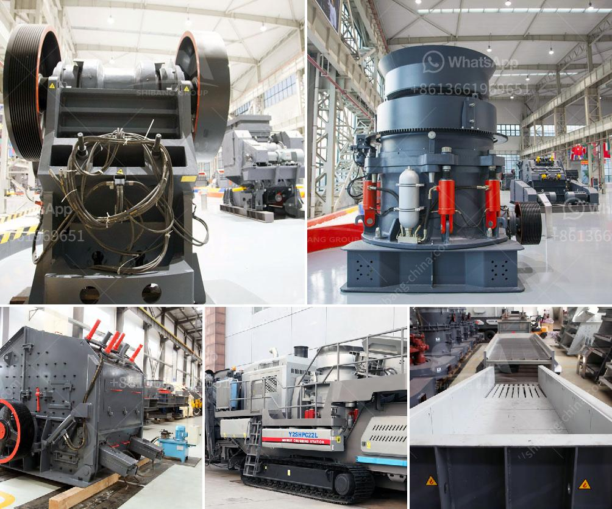

<h3>bentonite manufacturing process image</h3>
Bentonite is a versatile and highly useful mineral that finds its way into a wide range of applications across various industries. One of the fundamental aspects of its manufacturing process is the creation of bentonite manufacturing process images. These images offer a visual representation of the steps involved in producing this essential mineral. In this article, we will explore the manufacturing process of bentonite and the significance of process images in understanding the complexities involved.

Bentonite, primarily composed of montmorillonite, is formed from volcanic ash deposits that have undergone natural weathering. It is a unique mineral due to its exceptional water absorption and swelling capabilities. As a result, bentonite is extensively used in numerous commercial applications such as drilling fluids, foundry casting, cat litter, and environmental remediation.

The manufacturing process of bentonite involves several key steps that ensure its quality and desired properties. Firstly, mining is undertaken to extract bentonite deposits from the earth's crust. This involves the use of heavy machinery to excavate the raw material, which is then transported to processing plants for further treatment.

In the processing plants, the extracted raw bentonite is typically dried to eliminate any excess moisture. This process helps improve the stability and shelf life of the final product. Once dried, the bentonite is then pulverized into fine powder using various grinding and milling techniques.

To enhance the quality and performance of bentonite, additional processes such as activation, purification, and blending may be employed. Activation involves the treatment of the powder with specific chemicals or heat, to increase its surface area and reactivity. This treatment helps unlock the potential of bentonite by enhancing its absorption and binding capabilities.

Purification is another crucial step in the manufacturing process, where impurities are removed from the bentonite powder. These impurities can interfere with the desired properties of the mineral, and hence, their elimination guarantees a more refined and pure end product.

Once the purification process is complete, the bentonite may be blended with other additives or materials to obtain specific properties required for different applications. These additives can include polymers, binders, or other minerals, depending on the intended use of the final product. The blending process is carefully controlled to achieve the desired composition and consistency of the bentonite mixture.

Now, let's discuss the importance of process images in understanding the manufacturing process of bentonite. Manufacturing process images provide a visual representation of the various steps involved, making it easier for technicians, engineers, and other stakeholders to grasp the complexities of the process. These images depict the machinery, equipment, and techniques employed in each stage of manufacturing.

By studying process images, one can gain insights into the machinery used for mining, drying, pulverizing, activation, purification, and blending. This visual representation not only aids in better comprehension of the process but also helps identify potential areas for improvement and optimization.

In conclusion, the manufacturing process of bentonite involves multiple stages such as mining, drying, pulverizing, activation, purification, and blending. Process images play a crucial role in understanding the intricacies of each step and assist in achieving a high-quality end product. These images offer a visual guide to the machinery, equipment, and techniques utilized throughout the manufacturing process. By leveraging the insights provided by process images, manufacturers can continually refine and enhance their bentonite production, ensuring its suitability for a wide range of applications.
<h3>Contact us</h3><ul><li><strong>Whatsapp:&nbsp;<a href="https://wa.me/8613661969651">+8613661969651</a></strong></li><li><a href="https://swt.shibang-china.com/?git&amp;zhl&amp;bentonite manufacturing process image"><strong>Online Service(chat now)</strong></a></li></ul><h3>Related</h3><ul><li><a href='feldspar crusher equipment.md'>feldspar crusher equipment</a></li><li><a href='crushers rock crushers and minerals.md'>crushers rock crushers and minerals</a></li><li><a href='7x8 foot ball mills.md'>7x8 foot ball mills</a></li><li><a href='stone crushers plant prices.md'>stone crushers plant prices</a></li><li><a href='limestone jaw crusher sizes.md'>limestone jaw crusher sizes</a></li></ul>