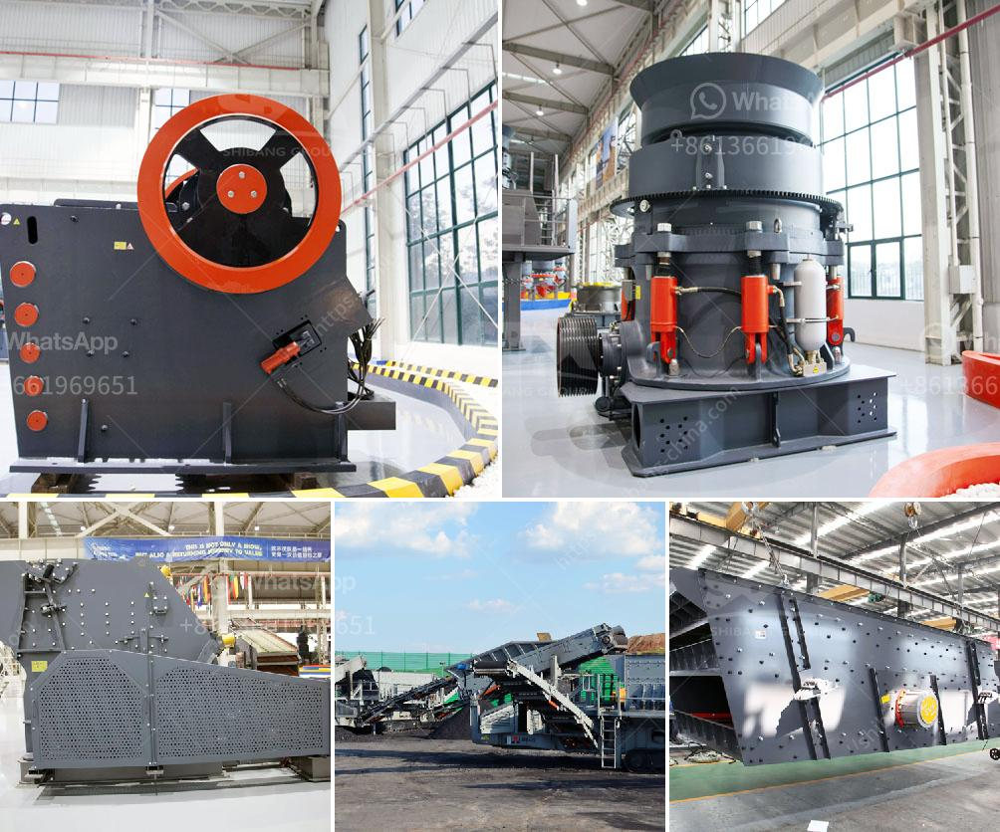

<h3>bentonite processing plant</h3>
Bentonite is a unique and highly versatile mineral composed of smectite clay. It is known for its ability to absorb and remove impurities, as well as its high swelling capacity. These properties make it an indispensable material in many industries, particularly in the construction sector.

The processing of bentonite involves several stages, each with its own set of equipment and machinery. The process begins by extracting bentonite from the earth's crust through mining. This process entails the use of heavy machinery and blasting techniques to remove the bentonite deposits from the soil.

Once the bentonite is extracted, it is transported to a processing plant. Here, the raw bentonite undergoes various treatment methods to remove impurities and enhance its properties. One of the common methods used is the dry method, which involves drying the raw material and then pulverizing it into a fine powder. This powder is then stored and awaits further processing.

The next step in the processing plant involves wet purification of the bentonite powder. This process is achieved by adding water to the powder and allowing it to settle. The impurities are then removed by decanting the water, leaving behind a purified bentonite slurry. Depending on the specific application, additional treatments may be required to further enhance the properties of the bentonite.

Once the purification process is complete, the bentonite slurry is processed and transformed into a variety of products suited for different applications. For instance, in the construction industry, bentonite is often used in the formulation of drilling muds, which are essential for drilling and excavation purposes. The high swelling capacity of bentonite helps in preventing the collapse of the borehole walls during drilling.

Bentonite is also used in the production of cement and concrete. Its ability to generate high viscosity slurries makes it an ideal additive in cement grouting, as it helps to improve the stability of the grout and prevent seepage. Additionally, bentonite can be used as a binder in concrete mixes, enhancing its plasticity and workability.

Moreover, bentonite is employed in the production of geosynthetic clay liners (GCLs), which are widely used in landfill liner systems. GCLs serve as a barrier to prevent the migration of hazardous substances into the surrounding environment. Their high swelling capacity and low permeability make them an effective solution for waste containment.

In conclusion, the establishment of a bentonite processing plant is highly beneficial to the construction industry. The versatility and unique properties of bentonite make it an essential material in various construction applications, such as drilling muds, cement grouting, and landfill liner systems. The processing plant ensures the production of high-quality bentonite products that meet industry standards and contribute to the overall efficiency and sustainability of construction projects.
<h3>Contact us</h3><ul><li><strong>Whatsapp:&nbsp;<a href="https://wa.me/8613661969651">+8613661969651</a></strong></li><li><a href="https://swt.shibang-china.com/?git&amp;zhl&amp;bentonite processing plant"><strong>Online Service(chat now)</strong></a></li></ul><h3>Related</h3><ul><li><a href='impact crusher in lima peru.md'>impact crusher in lima peru</a></li><li><a href='double roller crusher advantages.md'>double roller crusher advantages</a></li><li><a href='quote industrial mill quote ball mills.md'>quote industrial mill quote ball mills</a></li><li><a href='south africa biggest chrome wash plant.md'>south africa biggest chrome wash plant</a></li><li><a href='concrete recycling equipment manufacturers.md'>concrete recycling equipment manufacturers</a></li></ul>