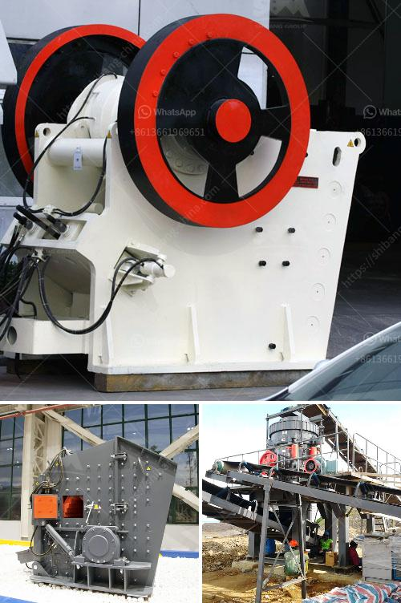

<h3>bentonite pulverizer ball mill in gujrat</h3>
Bentonite is a very important industrial product, which is widely used in many different industries such as construction, drilling, foundry, and pharmaceuticals. The pulverizer ball mill is a very common type of grinding equipment used for bentonite processing.

The bentonite pulverizer ball mill in Gujarat can grind various types of non-flammable and non-explosive materials including coal, limestone, dolomite, talc, gypsum, bentonite, clay, etc. It is also capable of grinding stone and other materials to a particle size of 20mm or less.

The bentonite mill utilizes the principle of attrition and impact to grind materials. The grinding media is usually steel balls, which are loaded into the mill. The ball mill grinds the material by rotating a cylinder with steel grinding balls, causing the balls to fall back into the cylinder and onto the material to be ground. The rotation is usually between 4 to 20 revolutions per minute, depending upon the diameter of the mill.

The bentonite pulverizer ball mill in Gujarat has a high production capacity and requires low investment cost. It is widely used in the mineral processing industry due to its simple structure and easy operation. The pulverizer ball mill mainly consists of a shell, feeding part, discharging part, hydraulic station, and lubrication system. The grinding media and materials are lifted and dropped by the rotating drum, resulting in the grinding of materials.

In conclusion, the bentonite pulverizer ball mill in Gujarat is an indispensable grinding equipment for bentonite powder production. It has the advantages of high production capacity, low energy consumption, economical operation, environmental protection, and easy maintenance. It is widely used in various industries and has a broad development prospect. With the continuous improvement of technology, the bentonite pulverizer ball mill will play an increasingly important role in the processing of bentonite and other materials.
<h3>Contact us</h3><ul><li><strong>Whatsapp:&nbsp;<a href="https://wa.me/8613661969651">+8613661969651</a></strong></li><li><a href="https://swt.shibang-china.com/?git&amp;zhl&amp;bentonite pulverizer ball mill in gujrat"><strong>Online Service(chat now)</strong></a></li></ul><h3>Related</h3><ul><li><a href='application of vertical grinding machine.md'>application of vertical grinding machine</a></li><li><a href='white stone crusher plant in rajasthan.md'>white stone crusher plant in rajasthan</a></li><li><a href='gold processing plant dry.md'>gold processing plant dry</a></li><li><a href='setup for limestone crusher plant.md'>setup for limestone crusher plant</a></li><li><a href='grinding plant in rajasthan.md'>grinding plant in rajasthan</a></li></ul>