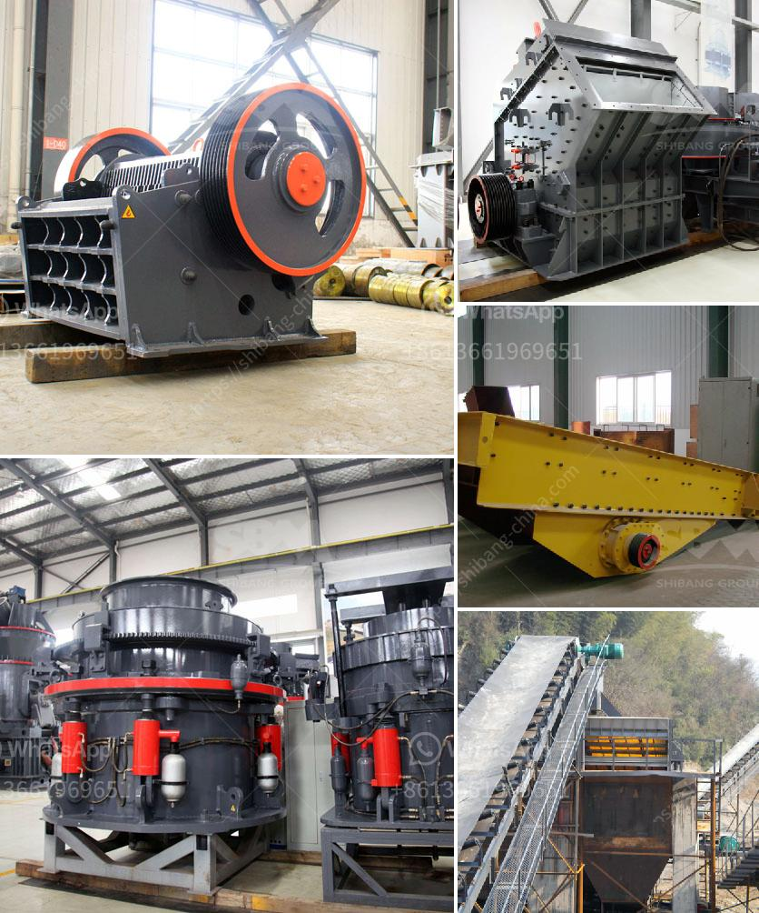

<h3>best machine for marble processing</h3>
The marble industry has witnessed rapid growth in recent years, and with it, the demand for efficient and reliable machines for processing this exquisite material. Choosing the right machine for marble processing can significantly impact productivity, quality, and overall efficiency.

One of the best machines for marble processing is the CNC machine. CNC (Computer Numerical Control) machines are known for their precision and accuracy in cutting and shaping materials. They use advanced technology to ensure smooth and intricate designs while reducing wastage and errors.

One of the key advantages of CNC machines for marble processing is their ability to automate the entire process. These machines can be programmed to perform specific tasks, such as cutting, shaping, and polishing, with optimal precision. This not only speeds up the production process but also ensures consistent quality and reduces the need for human intervention.

Moreover, CNC machines for marble processing come with various tool options, allowing for a wide range of designs and finishes. Whether it's intricate patterns, curved edges, or glossy surfaces, these machines can deliver exceptional results. Additionally, they can work with different types of marble, including both natural and engineered varieties.

Another excellent machine for marble processing is the bridge saw. Bridge saws are widely used in the industry for cutting large slabs of marble into smaller, more manageable sizes. These machines are designed to handle heavy-duty tasks and can make precise cuts with minimal effort.

Bridge saws are equipped with diamond-edged blades that effortlessly cut through the hardest marble slabs. They can be operated manually or automatically, depending on the specific requirements of the project. With their sturdy construction and high-quality components, bridge saws offer durability and longevity.

In conclusion, when it comes to marble processing, investing in the right machine is crucial. CNC machines and bridge saws are among the best options available, offering precision, efficiency, and versatility. By harnessing the power of advanced technology, these machines can help businesses in the marble industry streamline their operations and deliver superior products to meet the growing market demands.
<h3>Contact us</h3><ul><li><strong>Whatsapp:&nbsp;<a href="https://wa.me/8613661969651">+8613661969651</a></strong></li><li><a href="https://swt.shibang-china.com/?git&amp;zhl&amp;best machine for marble processing"><strong>Online Service(chat now)</strong></a></li></ul><h3>Related</h3><ul><li><a href='manganese ore processing machine price.md'>manganese ore processing machine price</a></li><li><a href='crushers for sale in uae.md'>crushers for sale in uae</a></li><li><a href='stone crusher plant in westbengal.md'>stone crusher plant in westbengal</a></li><li><a href='limestone crushing plant manufacturer.md'>limestone crushing plant manufacturer</a></li><li><a href='grinding machine manufacturers from europe.md'>grinding machine manufacturers from europe</a></li></ul>