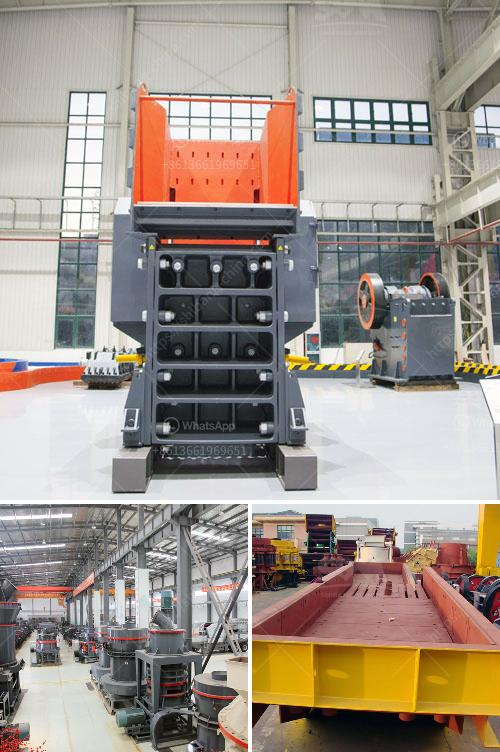

<h3>best wash plant for gold mining</h3>
Gold mining is a challenging and rewarding field of endeavor that requires perseverance, innovation, and a keen eye for efficiency. One of the essential tools used in gold mining operations is the wash plant. This equipment allows miners to remove dirt and debris from their samples, ensuring that only valuable material is processed further.

When it comes to choosing the best wash plant for gold mining, several factors need to be considered. The size of the operation, the type of material being processed, and the desired output are just a few of the variables to take into account. Based on these factors, one wash plant that stands out is the trommel wash plant.

A trommel wash plant is a popular choice for gold mining operations due to its simplicity and effectiveness. The trommel design consists of a rotating cylinder with small holes that allow water and smaller particles to pass through while larger rocks and material are retained. This separation process helps to ensure maximum efficiency in gold recovery.

One renowned trommel wash plant known for its reliability and performance is the Gold Cube Trommel. This compact and portable unit is designed to efficiently process up to 1,000 pounds of material per hour. With its unique three-stage system, it ensures that no gold is lost during the process, making it ideal for small to medium-sized mining operations.

The Gold Cube Trommel utilizes gravity-driven water flow to separate and wash the material, making it environmentally friendly and cost-effective. Its compact size allows for easy transportation, making it suitable for remote or hard-to-reach mining locations.

Another notable wash plant option is the 2410-V Portable Gold Trommel Wash Plant by MSI Mining. This larger unit can process up to 300 tons per hour and is specifically designed for heavy-duty applications. The 2410-V features multiple spray bars, adjustable water pressure, and a robust construction that can withstand the rigors of gold mining.

In conclusion, choosing the best wash plant for gold mining requires careful consideration of your specific needs and mining operation. While the Gold Cube Trommel and the 2410-V Portable Gold Trommel Wash Plant are excellent options, it is important to evaluate other factors such as budget, available space, and the type of material being processed. With thorough research and informed decision-making, miners can select the wash plant that will maximize their gold recovery and ultimately lead to successful mining operations.
<h3>Contact us</h3><ul><li><strong>Whatsapp:&nbsp;<a href="https://wa.me/8613661969651">+8613661969651</a></strong></li><li><a href="https://swt.shibang-china.com/?git&amp;zhl&amp;best wash plant for gold mining"><strong>Online Service(chat now)</strong></a></li></ul><h3>Related</h3><ul><li><a href='price of artificial sand mill.md'>price of artificial sand mill</a></li><li><a href='iron ore crushing equipment cost.md'>iron ore crushing equipment cost</a></li><li><a href='vibrating screen specification pdf.md'>vibrating screen specification pdf</a></li><li><a href='crusher sand and stone in kenya.md'>crusher sand and stone in kenya</a></li><li><a href='100tph stationery stone crushing plant.md'>100tph stationery stone crushing plant</a></li></ul>