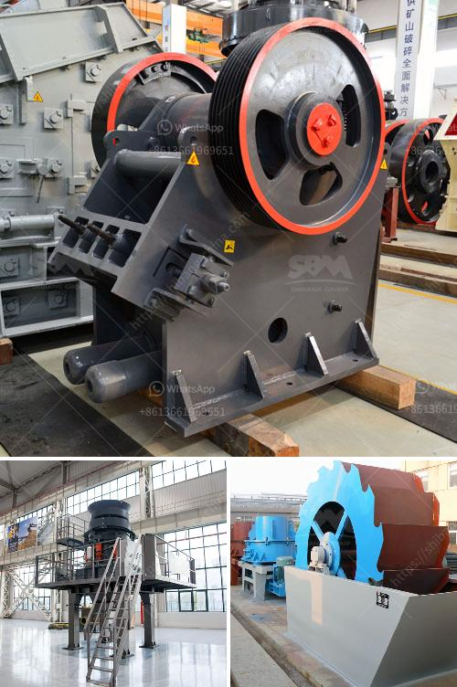

<h3>bison 120 crusher for sale</h3>
The Bison 120 crusher is a robust and versatile small mobile jaw crusher, perfect for contractors and quarry operators alike. This highly efficient machine boasts an impressive 680mm x 400mm jaw opening, allowing it to effortlessly crush materials such as concrete, bricks, paving stones, and more. With a maximum feed size of 500mm, the Bison 120 crusher guarantees excellent productivity and outstanding reduction ratios.

One of the key features of the Bison 120 crusher is its compact size and lightweight design, making it easy to transport and maneuver in tight spaces. Whether you need to crush materials on a construction site or in a quarry, this mobile jaw crusher offers exceptional flexibility and convenience. The hydraulically adjustable jaw setting allows for precise output size control, giving operators full control over the final product.

Designed to excel in challenging conditions, the Bison 120 crusher is powered by a fuel-efficient 27.3kW (37hp) engine. This ensures optimal performance while minimizing fuel consumption and reducing emissions. Additionally, the crusher is equipped with a heavy-duty vibrating grizzly feeder, which enhances the machine's efficiency by removing fines before they reach the jaw. This prevents unnecessary wear on the jaw plates and improves overall productivity.

Safety is also a top priority with the Bison 120 crusher. The machine features a bypass conveyor and magnet, which separate out any rebar or metal contaminants from the crushed material. This not only protects the jaw and other components of the crusher but also ensures the production of clean, high-quality aggregates.

If you are in the market for a high-performing and reliable crusher, the Bison 120 crusher is an excellent choice. Its compact size, maneuverability, and exceptional crushing capabilities make it the perfect solution for a wide range of applications. With its powerful engine, adjustable jaw setting, and advanced safety features, the Bison 120 crusher guarantees efficient and productive crushing operations. Don't miss out on the opportunity to own this versatile and durable machine, get your Bison 120 crusher for sale today!
<h3>Contact us</h3><ul><li><strong>Whatsapp:&nbsp;<a href="https://wa.me/8613661969651">+8613661969651</a></strong></li><li><a href="https://swt.shibang-china.com/?git&amp;zhl&amp;bison 120 crusher for sale"><strong>Online Service(chat now)</strong></a></li></ul><h3>Related</h3><ul><li><a href='coal crusher and screening plants for sale.md'>coal crusher and screening plants for sale</a></li><li><a href='vibrating sieving machine.md'>vibrating sieving machine</a></li><li><a href='dry process of cement manufacturing.md'>dry process of cement manufacturing</a></li><li><a href='to choose jaw crusher.md'>to choose jaw crusher</a></li><li><a href='proposal usaha stone crusher.md'>proposal usaha stone crusher</a></li></ul>