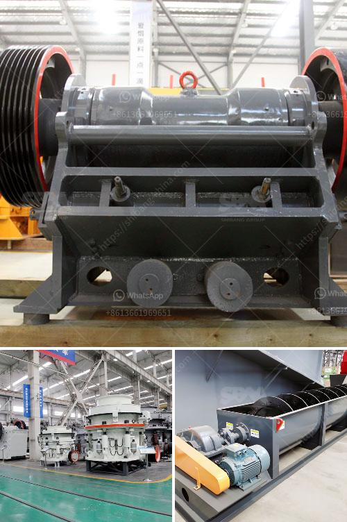

<h3>black stone crushing nigeria</h3>
Black stone crushing in Nigeria is a professional process in accordance within the production process of black stone crusher for Nigeria. The black stone crushing plant production line will be equipped with the main stone crusher in sweden crushing machines and auxiliary equipment. black stone crushing plant production line consists of vibrating feeder, jaw crusher, impact crusher, vibrating screen, belt conveyor and centralized control equipment components; design yield is generally 50-500 tons / hour. In order to meet the different processing needs of customers, it can be equipped with cone crusher, dust removal equipment, etc.

The processed black stone materials are widely used in industries such as chemical, metallurgy, road construction and water conservancy. The Black Stone Crushing Plant production line is developed by introducing the advanced technology and combining with the actual production situation. The equipment selection of this production line is advanced and scientific, with high degree of automation, low running cost, high crushing ratio and energy saving. It can be widely used in highway, bridge, urban construction, metallurgy, energy and other departments, crushing, screening and other operations.

The Black Stone Crushing has been used in reconstruction in the past few years and the progress of infrastructure construction has now come to a high level. Infrastructural projects are coming up every day in the country. In Nigeria, so many infrastructure construction projects are being carried out by the government that demand for stone crusher is becoming higher and higher. However, the number of stone crushing plants is not enough to support the huge demand from the infrastructure construction projects. Because the raw materials are like pebbles, black stone, limestone and other mineral ores, these mineral ores do not have good sales and market situation. The stone crushing plant will be a good helper in these infrastructure construction activities.
<h3>Contact us</h3><ul><li><strong>Whatsapp:&nbsp;<a href="https://wa.me/8613661969651">+8613661969651</a></strong></li><li><a href="https://swt.shibang-china.com/?git&amp;zhl&amp;black stone crushing nigeria"><strong>Online Service(chat now)</strong></a></li></ul><h3>Related</h3><ul><li><a href='crusher machine for sale philippines.md'>crusher machine for sale philippines</a></li><li><a href='limestone field crushing plant.md'>limestone field crushing plant</a></li><li><a href='calcium carbonate machinery.md'>calcium carbonate machinery</a></li><li><a href='hammer crusher pc400.md'>hammer crusher pc400</a></li><li><a href='iron ore pellet plant in odisha.md'>iron ore pellet plant in odisha</a></li></ul>