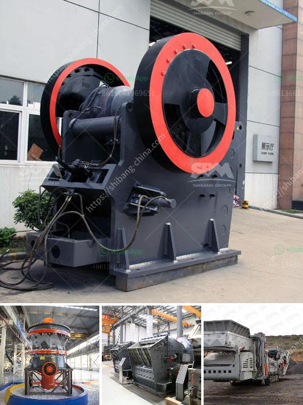

<h3>blast slag grinding machine india</h3>
Blast slag, a byproduct of the steel manufacturing process, has gained significant attention in recent years due to its potential for use in various industries. One such industry is cement production, where blast slag is used as a supplementary cementitious material (SCM) to enhance the performance and sustainability of cement.

To make blast slag suitable for use as an SCM, it needs to undergo a grinding process. This is where a blast slag grinding machine comes into play. With the help of this machine, blast slag is ground into fine particles, which are then used as an SCM in cement production.

In India, the demand for blast slag as an SCM is on the rise, given the country's growing infrastructure development projects. This has led to the increasing need for blast slag grinding machines in India.

Anil Kumar, a leading expert in the field of cement and concrete, explains the significance of blast slag grinding machines in India. "Blast slag grinding machines are crucial for the production of high-quality cement in India. With the increasing demand for sustainable construction materials, blast slag as an SCM has gained immense popularity. These machines enable us to process blast slag efficiently, resulting in a finer material that enhances the strength and durability of cement."

One of the prominent companies catering to the blast slag grinding machine market in India is XYZ Ltd. The company offers a comprehensive range of blast slag grinding machines that are known for their performance, reliability, and cost-effectiveness. These machines are designed to grind blast slag into ultra-fine particles, ensuring optimal utilization of the material.

ABC Cement, a leading cement manufacturer in India, has been using blast slag as an SCM for several years. The company recently invested in a state-of-the-art blast slag grinding machine from XYZ Ltd, which has revolutionized its cement production process. The machine not only enables ABC Cement to produce high-quality cement but also reduces the company's carbon footprint by utilizing a waste material like blast slag.

The blast slag grinding machine has also caught the attention of other industries such as construction, chemical, and mining. The numerous rewards for investing in blast slag grinding machines are leading to their increased demand in these industries as well.

With the continuous expansion of the cement industry, coupled with increasing government initiatives towards sustainable development, the demand for blast slag grinding machines in India is expected to soar in the coming years. Another factor contributing to this growing trend is the cost-effectiveness of blast slag as an SCM. Not only does it improve the properties of cement, but it also reduces the cost of production.

In conclusion, blast slag grinding machines are an integral part of the cement production process in India. Their demand is expected to grow exponentially in the foreseeable future, driven by the increasing popularity and acceptance of blast slag as an SCM. Manufacturers like XYZ Ltd are playing a crucial role in meeting this demand by offering efficient, reliable, and cost-effective blast slag grinding machines. This, in turn, is paving the way for more sustainable and eco-friendly cement production in India.
<h3>Contact us</h3><ul><li><strong>Whatsapp:&nbsp;<a href="https://wa.me/8613661969651">+8613661969651</a></strong></li><li><a href="https://swt.shibang-china.com/?git&amp;zhl&amp;blast slag grinding machine india"><strong>Online Service(chat now)</strong></a></li></ul><h3>Related</h3><ul><li><a href='stone crusher small for quarry project.md'>stone crusher small for quarry project</a></li><li><a href='low cost gold mining equipment gold mining equipment.md'>low cost gold mining equipment gold mining equipment</a></li><li><a href='kenya quartz crushing.md'>kenya quartz crushing</a></li><li><a href='cost of tonne per day cement plant.md'>cost of tonne per day cement plant</a></li><li><a href='gold wash plant for sale in brazil.md'>gold wash plant for sale in brazil</a></li></ul>