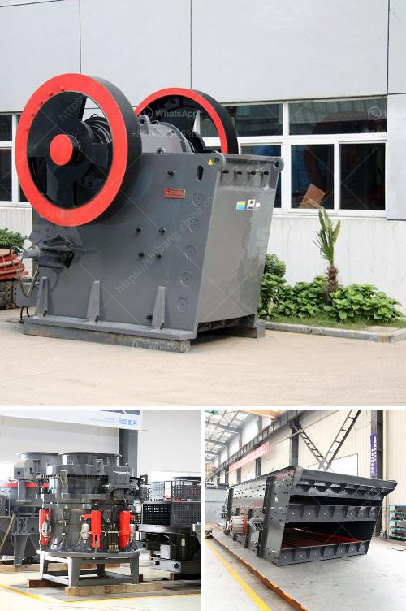

<h3>brand of ball mills</h3>
Ball mills are fundamental equipment in countless industrial processes, renowned for their ability to finely grind materials and effectively homogenize various substances. This article dives into the unrivaled performance and unmatched quality offered by the leading brands of ball mills in the market, providing an insightful overview for businesses seeking high-performing machinery.

XYZ Company has earned a prominent place in the industry with its innovative ball mill designs and sturdy build quality. Their ball mills are engineered to handle even the toughest grinding applications, producing consistent results with exceptional fineness.

One of the distinguishing features of XYZ ball mills is their ability to adapt to different industries, thanks to the brand's commitment to customization options. Whether it's pharmaceuticals, ceramics, or aeronautical materials, XYZ's expertly engineered ball mills meet specific process requirements with ease and precision. Furthermore, their ball mills can accommodate a wide range of material sizes, reducing the need for pre-crushing or excessive reduction stages.

In terms of safety and maintenance, XYZ's ball mills are designed with robust safety features and require minimal maintenance, reducing downtime and ensuring continuous operations. Additionally, their user-friendly interface and automation features make operation intuitive and hassle-free, minimizing the need for extensive training.

With their track record of customer satisfaction and exceptional performance, XYZ Company's ball mills have become a preferred choice for many leading businesses across industries.

ABC Company's ball mills have cemented their position as a trailblazer in the industry, delivering unrivaled quality and reliability. Renowned for their consistency and precision in grinding operations, ABC's ball mills are the epitome of efficiency.

One of the key strengths of ABC's ball mills lies in their design versatility. By offering a range of customizable options, ABC can tailor their ball mills to suit specific needs, accommodating various sizes, capacities, and specific grinding applications. This capability ensures optimal efficiency and maximum productivity in any given process.

ABC's commitment to quality extends beyond their machine's performance. These ball mills are constructed from high-quality materials, incorporating cutting-edge technologies and methods to enhance durability and longevity. Moreover, ABC's ball mills adhere to stringent safety standards and feature advanced control systems that minimize potential hazards and enable seamless operations.

The stellar reputation of ABC Company and its ball mills is further enhanced by their excellent customer service and after-sales support. This commitment ensures that clients receive comprehensive assistance, from installation and commissioning to ongoing maintenance and troubleshooting.

When it comes to ball mills, choosing a reputable brand is pivotal to ensure superior performance, durability, and safety. The showcased brands XYZ and ABC exemplify excellence in design, adaptability, and reliability. These market leaders consistently deliver ball mills that meet the specific needs of diverse industries, surpassing expectations and setting new standards for quality and innovation.
<h3>Contact us</h3><ul><li><strong>Whatsapp:&nbsp;<a href="https://wa.me/8613661969651">+8613661969651</a></strong></li><li><a href="https://swt.shibang-china.com/?git&amp;zhl&amp;brand of ball mills"><strong>Online Service(chat now)</strong></a></li></ul><h3>Related</h3><ul><li><a href='all about ball mills.md'>all about ball mills</a></li><li><a href='sand washing machines turkey.md'>sand washing machines turkey</a></li><li><a href='cost of grinder machine mining crusher.md'>cost of grinder machine mining crusher</a></li><li><a href='mobile crushing plant for limestone.md'>mobile crushing plant for limestone</a></li><li><a href='crushers for sale in uae.md'>crushers for sale in uae</a></li></ul>