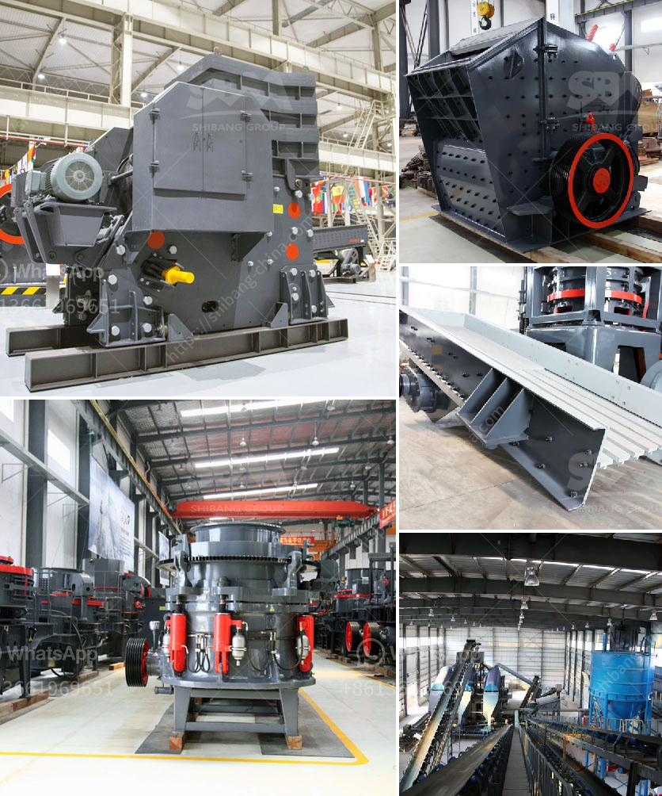

<h3>breaker crusher used for coal crushing</h3>
Coal is a fossil fuel extracted from the ground by underground mining or open-pit mining. It is the most abundant energy source on the planet, making it a crucial component in the global energy mix. Coal is primarily used for electricity generation, steel production, and as a feedstock for various industrial processes.

To efficiently extract coal from mines, it must undergo several stages of crushing and processing. One of the crucial steps in this process is the crushing of the coal. This article focuses primarily on the breaker crusher used for coal crushing.

Coal crushers play a critical part in the coal handling plants and thermal power generation stations. They generate power by reducing the size of the coal and passing it through various stages of crushing, sizing, and washing. Crushers are efficient equipment that utilize impact, compression, and shear forces to break the coal into smaller sizes.

Breaker crushers are specifically designed to break oversize coal pieces and handle high capacities. They consist of a rotor with swinging hammers that strike the coal. The coal particles are segregated by size as they pass through the crusher. Larger particles are crushed and broken down to the desired size, while smaller ones bypass the crusher to maintain the required size range.

1. Impact Crushers: These crushers use impact force to break the coal and are generally used for larger coal sizes. They consist of hammers or blow bars mounted on a rotor, which impacts the coal when it is fed into the crusher. Impact crushers are ideal for crushing soft and non-abrasive materials such as coal, limestone, gypsum, and cement.

2. Single Roll Crushers: These crushers utilize shear force to break down the coal. They consist of a single roll with teeth or spikes that rotate at a high speed. The coal is fed between the roll and the crushing plate, and it gets crushed and reduced in size as it passes through the crusher. Single roll crushers are commonly used for coal crushing in power plants, mines, and other industries.

1. Increased Efficiency: Breaker crushers are designed to efficiently break down coal and reduce it to the desired size. This improves the efficiency of subsequent operations, such as conveying, screening, and washing.

2. Reduced Energy Consumption: Proper coal crushing with breaker crushers ensures that only the necessary energy is used, reducing overall energy consumption and minimizing operational costs.

3. Improved Product Quality: The use of breaker crushers reduces the generation of fines and ensures uniform product size distribution. This results in higher quality coal with consistent properties.

4. Enhanced Safety: Breaker crushers are equipped with various safety features to ensure safe operation. These include safety guards, emergency stop buttons, and advanced control systems to prevent accidents and protect personnel.

5. Increased Throughput: Breaker crushers can handle high capacities, allowing for efficient coal processing in large-scale operations. They can process large volumes of coal quickly, enhancing overall plant productivity.

In conclusion, breaker crushers are critical equipment for efficient coal crushing. They provide benefits in terms of increased efficiency, reduced energy consumption, improved product quality, enhanced safety, and increased throughput. As the demand for coal continues to rise, the utilization of efficient crushing equipment becomes increasingly important to ensure sustainable and reliable energy production.
<h3>Contact us</h3><ul><li><strong>Whatsapp:&nbsp;<a href="https://wa.me/8613661969651">+8613661969651</a></strong></li><li><a href="https://swt.shibang-china.com/?git&amp;zhl&amp;breaker crusher used for coal crushing"><strong>Online Service(chat now)</strong></a></li></ul><h3>Related</h3><ul><li><a href='200 tph crusher plant.md'>200 tph crusher plant</a></li><li><a href='cement manufacturing process pdf.md'>cement manufacturing process pdf</a></li><li><a href='ton per hour coal crushing plant.md'>ton per hour coal crushing plant</a></li><li><a href='feldspar vsi crusher.md'>feldspar vsi crusher</a></li><li><a href='used portable crusher for sale in germany.md'>used portable crusher for sale in germany</a></li></ul>