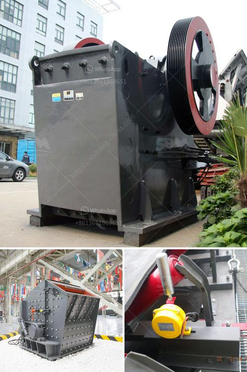

<h3>brick factory for sale in uk</h3>
The brick manufacturing industry in the United Kingdom has witnessed substantial growth in recent years, mainly driven by increased construction activities. As a result, the demand for house building materials, such as bricks, has soared, creating opportunities for investors and entrepreneurs. For those with a keen eye for business, purchasing a brick factory for sale in the UK can be an exciting venture, albeit with several considerations to be mindful of.

The UK's thriving construction sector, bolstered by government initiatives promoting housing development, has fueled the demand for bricks across the country. As sustainable and durable building materials, bricks continue to be a popular choice for both residential and commercial projects. This sustained demand contributes significantly to the attractiveness of investing in a brick factory, ensuring a steady stream of customers and promising long-term viability.

1. Profitability: With the rising demand for bricks, an efficiently operated brick factory has the potential for substantial profits. The reduced reliance on importing bricks from overseas manufacturers, combined with reduced transportation costs and increased production volume, can significantly enhance margins and financial returns.

2. Environmental Considerations: Brick manufacturing can be a sustainable business endeavor. The use of locally-sourced materials, such as clay and shale, reduces the environmental impact associated with long-distance supply chains. Furthermore, as bricks are exceptionally durable and energy-efficient, they contribute to the overall sustainability and design integrity of both residential and commercial structures.

1. Initial Capital Investment: Acquiring an existing brick factory or starting a new one requires a considerable upfront investment. Machinery, kilns, and equipment need to be maintained and upgraded periodically, setting the stage for substantial initial capital outlays.

2. Market Competition: While the demand for bricks in the UK is strong, the market is not without competition. Existing brick manufacturers already dominate the industry landscape. As a result, to succeed, potential brick factory owners must carefully assess local competition and identify unique selling propositions that set their business apart.

3. Regulatory Compliance: Brick factories must adhere to strict environmental and safety regulations to minimize their impact on the environment and ensure the well-being of their workforce. Consequently, acquiring a brick factory also means understanding and adhering to these regulations, which may add complexity and costs to the operational setup.

Investing in a brick factory for sale in the UK can be a lucrative opportunity, thanks to the sustained demand for bricks in the construction market. However, potential buyers must comprehend the challenges associated with this industry, such as large initial investments, market competitiveness, and regulatory compliance. Success in the brick manufacturing sector requires a solid business plan, efficient production processes, and strategies to stand out in a crowded market. For those who overcome these obstacles, owning a brick factory in the UK can bring long-term stability, profitability, and a contribution to sustainable construction practices.
<h3>Contact us</h3><ul><li><strong>Whatsapp:&nbsp;<a href="https://wa.me/8613661969651">+8613661969651</a></strong></li><li><a href="https://swt.shibang-china.com/?git&amp;zhl&amp;brick factory for sale in uk"><strong>Online Service(chat now)</strong></a></li></ul><h3>Related</h3><ul><li><a href='stone crusher small for quarry project.md'>stone crusher small for quarry project</a></li><li><a href='coal grinding plant.md'>coal grinding plant</a></li><li><a href='rotary hammer mills with dispenser.md'>rotary hammer mills with dispenser</a></li><li><a href='recycled concrete crusher.md'>recycled concrete crusher</a></li><li><a href='cement manufacturing plant.md'>cement manufacturing plant</a></li></ul>