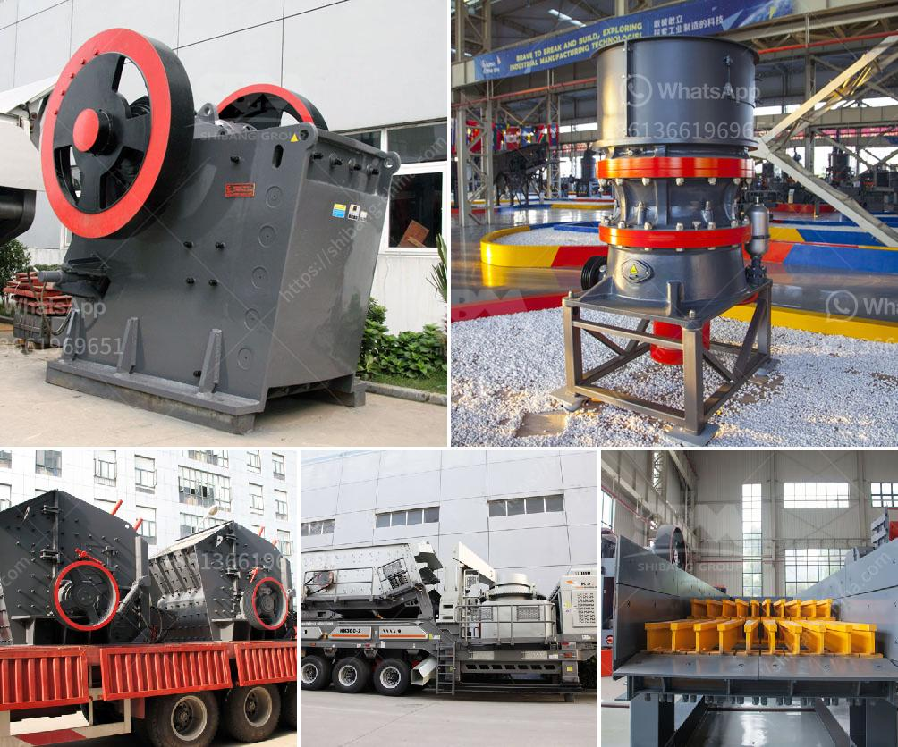

<h3>brick making machine in zimbabwe</h3>
In recent years, the construction industry in Zimbabwe has experienced a significant transformation thanks to the introduction of modern technology, particularly the brick making machine. This innovation has revolutionized the way bricks are produced and has had a profound impact on the quality and efficiency of construction projects throughout the country.

Traditionally, brick making in Zimbabwe was a labor-intensive and time-consuming process. Workers would manually mix clay, mold the bricks, and then sun-dry them. This method proved to be slow and often yielded bricks of inconsistent quality. With the advent of brick making machines, however, Zimbabwean construction companies are now able to produce bricks in a faster, more cost-effective, and environmentally-friendly manner.

The brick making machine automates the entire production process, from mixing the raw materials to forming and cutting the bricks. This not only saves considerable time but also ensures uniformity in size and shape, resulting in higher quality bricks. Moreover, the machines are equipped with a curing chamber, allowing for controlled drying of the bricks, which further enhances their durability.

One notable advantage of using brick making machines is their ability to utilize locally available raw materials. Zimbabwe is rich in clay, which serves as the primary ingredient for brick production. By sourcing clay locally, construction companies not only cut costs but also contribute to the local economy.

Additionally, the use of brick making machines has significant environmental benefits. Unlike traditional brickmaking methods that relied on wood-burning kilns, modern machines operate on electricity or other eco-friendly energy sources. This eliminates the need for deforestation and reduces harmful emissions, making it a sustainable alternative for brick production.

The introduction of brick making machines in Zimbabwe has undoubtedly transformed the construction industry. It has enabled construction companies to produce bricks of higher quality, streamline production processes, and contribute to sustainable development. As the country continues to invest in infrastructure and urban development, the demand for these machines is only expected to grow.
<h3>Contact us</h3><ul><li><strong>Whatsapp:&nbsp;<a href="https://wa.me/8613661969651">+8613661969651</a></strong></li><li><a href="https://swt.shibang-china.com/?git&amp;zhl&amp;brick making machine in zimbabwe"><strong>Online Service(chat now)</strong></a></li></ul><h3>Related</h3><ul><li><a href='clay processing clay processing south africa.md'>clay processing clay processing south africa</a></li><li><a href='vertical roller mill manufacturer.md'>vertical roller mill manufacturer</a></li><li><a href='clay ball mills south africa.md'>clay ball mills south africa</a></li><li><a href='dolomite grinding machines suppliers in india.md'>dolomite grinding machines suppliers in india</a></li><li><a href='all about ball mills.md'>all about ball mills</a></li></ul>