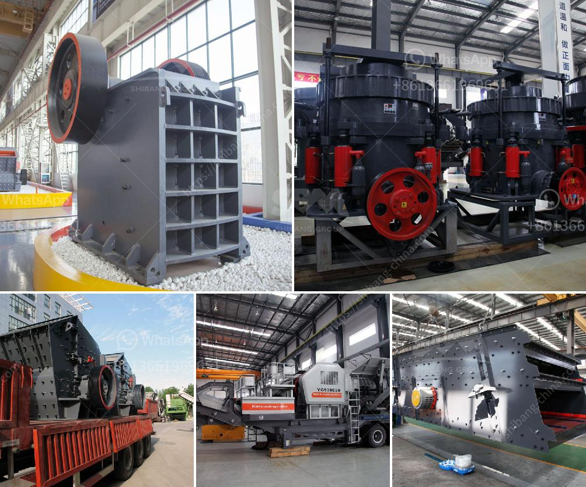

<h3>brick stone crusher machine</h3>
Brick stone crusher machine is the traditional crushing equipment for the brick production process and it has a wide application range in the building materials industry. It is mainly used to crush bulk and medium-sized stones into different specifications for various construction activities such as road, pavement, bridge and building.

With the rapid development of the construction industry, the demand for brick stone crusher machine is increasing. Many construction sites across the country are using the equipment, which improves the working efficiency and reduces the labor cost. The machine is designed with advanced crushing technology and can crush various materials with high efficiency and low energy consumption.

One of the key advantages of using brick stone crusher machine is its flexibility. It can process different types of materials, such as limestone, granite, pebbles, basalt, andesite, etc., and the finished products have uniform particle size and high compressive strength. This makes it suitable for various construction projects, from small-scale residential buildings to large-scale infrastructure projects.

In addition to the flexibility, the brick stone crusher machine is also characterized by its high production capacity. It can crush 50-800 tons of stones per hour, accounting for more than 60% of the total production capacity of the whole crushing system. When working, the machine continuously crushes large pieces of stones into smaller ones, ensuring the continuous supply of materials for the construction site.

Furthermore, brick stone crusher machine is equipped with an advanced hydraulic system, which can provide continuous overload protection and adjust the discharge opening. This ensures the stability and reliability of the machine during operation, reducing the downtime and increasing the production efficiency.

Another important feature of the brick stone crusher machine is its environmental friendliness. The machine is equipped with a dust removal system, which can effectively control the dust pollution during the crushing process. This not only protects the environment but also creates a clean and comfortable working environment for the operators.

To sum up, brick stone crusher machine is an indispensable equipment in the construction industry. It can crush a variety of stones into different specifications for various construction purposes. With its high production capacity, flexibility, advanced crushing technology, and environmental friendliness, the machine has become the preferred choice for many construction sites. Its wide application range, high efficiency, and low energy consumption make it an essential equipment for the sustainable development of the construction industry.

In conclusion, the brick stone crusher machine plays a vital role in the construction industry. With the continuous development of the industry, the machine will continue to evolve and meet the diverse needs of construction sites. It has become an important equipment that drives the construction industry forward.
<h3>Contact us</h3><ul><li><strong>Whatsapp:&nbsp;<a href="https://wa.me/8613661969651">+8613661969651</a></strong></li><li><a href="https://swt.shibang-china.com/?git&amp;zhl&amp;brick stone crusher machine"><strong>Online Service(chat now)</strong></a></li></ul><h3>Related</h3><ul><li><a href='old used farm hammer mills.md'>old used farm hammer mills</a></li><li><a href='roller crusher manufacturer.md'>roller crusher manufacturer</a></li><li><a href='small scale gold mining professional equipment.md'>small scale gold mining professional equipment</a></li><li><a href='single stage hammer crusher hot sale.md'>single stage hammer crusher hot sale</a></li><li><a href='cara perhitungan hasil produksi stone crusher.md'>cara perhitungan hasil produksi stone crusher</a></li></ul>