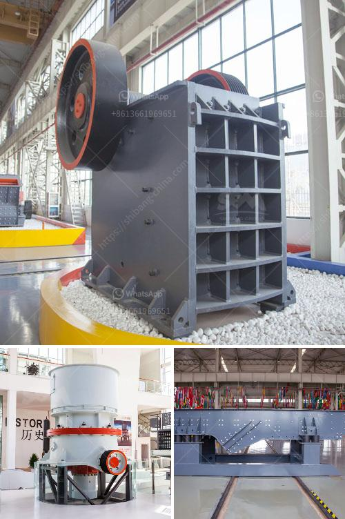

<h3>business plan for marble and granite factory pdf</h3>
A marble and granite factory is a lucrative venture in the construction and decoration industry. Striking the right chord between business opportunities and sustainable growth requires a well-designed business plan. This article aims to provide a comprehensive overview of the key elements to consider when developing a business plan for a marble and granite factory, all of which can be conveniently compiled into a PDF format.

The executive summary serves as a brief introduction to the entire business plan, offering a snapshot of the marble and granite factory's goals, potential market, competitive advantage, financial projections, and growth strategies. Convey the essence of the business plan clearly, ensuring potential investors and stakeholders grasp your vision.

In this section, outline the nature of your business, your target market, and the vision and mission guiding your marble and granite factory. Provide a detailed explanation of the products and services you intend to offer, highlighting their unique selling points and quality differentiators. Discuss your competitive advantages, such as advanced machinery or eco-friendly techniques.

Thoroughly research the target market for marble and granite products, identifying potential customers, competitors, and industry trends. Analyze market segmentation, size, growth rates, and demand patterns. This section should also include a SWOT analysis, outlining your factory's strengths, weaknesses, opportunities, and threats.

Elucidate your strategies for positioning and promoting your products effectively. Discuss your pricing strategy, distribution channels, and marketing tactics. A strong online presence, participation in industry trade shows, and forming strategic partnerships with contractors and interior designers can aid effective market penetration.

Provide a detailed overview of your production process, including the sourcing of raw materials, machinery, and equipment. Describe the layout of your factory, production capacity, and quality control processes. Additionally, outline the organizational structure, roles and responsibilities of key personnel, and any required professional certifications.

Create a comprehensive financial plan that covers the initial investment required, expected revenue, costs, and profitability analysis. Include a profit and loss statement, cash flow projections, balance sheet, and break-even analysis for at least the first three years of operation. It is crucial to incorporate contingency plans and risk management strategies within the financial section of your business plan.

Incorporate sustainable practices and environmentally friendly initiatives in your business plan. Discuss waste management strategies, energy-efficient technologies, and responsible sourcing of raw materials. This will not only cater to eco-conscious customers but also position your factory as a responsible corporate citizen.

Crafting a comprehensive business plan for a marble and granite factory is essential in attracting potential investors, securing loans, and outlining your path to success. A well-structured PDF document that encompasses an executive summary, market analysis, marketing strategies, operations, and financial projections can guide your factory towards profitability and sustainable growth. Remember to regularly update and revise your business plan as your operation evolves to ensure its alignment with market dynamics and emerging trends.
<h3>Contact us</h3><ul><li><strong>Whatsapp:&nbsp;<a href="https://wa.me/8613661969651">+8613661969651</a></strong></li><li><a href="https://swt.shibang-china.com/?git&amp;zhl&amp;business plan for marble and granite factory pdf"><strong>Online Service(chat now)</strong></a></li></ul><h3>Related</h3><ul><li><a href='vibrating sieving machine.md'>vibrating sieving machine</a></li><li><a href='chilli crushing machine project report.md'>chilli crushing machine project report</a></li><li><a href='bauxite processing plant.md'>bauxite processing plant</a></li><li><a href='dolomite crusher turkey 200 ton price.md'>dolomite crusher turkey 200 ton price</a></li><li><a href='portable stone crusher machine in philippines.md'>portable stone crusher machine in philippines</a></li></ul>