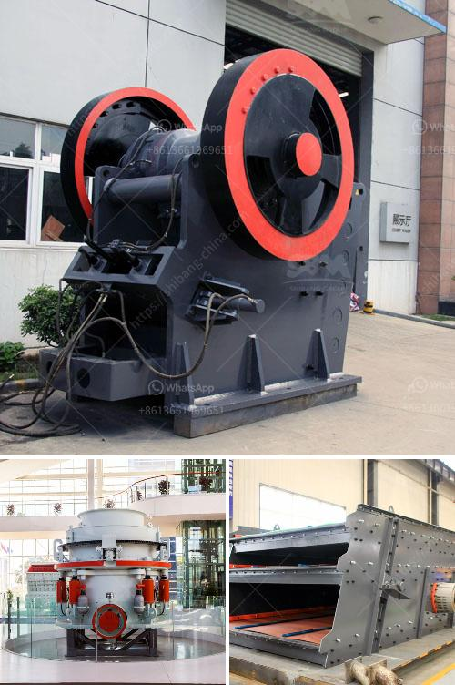

<h3>business plan for small scale chrome mining crusher</h3>
A business plan for small scale chrome mining crusher is a strategic document that outlines the objectives and goals for the business and determines the best approach to achieve them. The plan describes the business model, market potential, financial projections, funding requirements, and marketing strategies. This article will outline the key components of a business plan for a small scale chrome mining crusher.

The executive summary is a brief overview of the entire business plan. It highlights the key points, such as the purpose of the business, target market, and financial projections. This section should capture the reader's attention and provide them with a clear understanding of the business and its potential.

The company description provides information about the business structure, ownership, and location. It also outlines the mission and vision statements, highlighting the company's core values and long-term objectives. In this section, it is important to describe the unique selling proposition of the small scale chrome mining crusher and how it differentiates itself from competitors.

The market analysis assesses the industry trends, target market demographics, and competition in the chrome mining crusher sector. It identifies potential customers, their needs, and purchasing behavior. This section should also include an analysis of the demand and supply factors, as well as any market barriers or challenges.

The product or service line section describes the small scale chrome mining crusher's offerings, including the features, benefits, and competitive advantage. It details the production process, quality control measures, and how the product or service will meet customer demands. Additionally, this section may highlight any future product or service development plans.

The marketing and sales strategy outlines how the small scale chrome mining crusher plans to attract, engage, and retain customers. It includes the marketing mix, such as product positioning, pricing strategy, distribution channels, and promotional activities. This section should also outline the sales approach, including sales targets, customer relationship management, and after-sales service.

The financial projections section provides an overview of the expected financial performance of the small scale chrome mining crusher. It includes projected revenue, costs, and profitability over a specific period, usually three to five years. This section should also include a break-even analysis, cash flow statement, and balance sheet.

The funding requirements section outlines the financial needs of the small scale chrome mining crusher. It specifies the amount of capital required to start and operate the business, including details on how the funds will be used. This section may also include information about potential sources of funding, such as loans, investors, or grants.

The implementation plan details the operational aspects of the small scale chrome mining crusher. It describes the production process, supply chain management, and equipment requirements. Additionally, this section outlines the organizational structure, roles and responsibilities, and key milestones.

The risk assessment section identifies and evaluates the potential risks and challenges that the small scale chrome mining crusher may face. This includes market risks, operational risks, financial risks, and regulatory risks. It also outlines the strategies and measures that will be implemented to mitigate these risks.

In conclusion, a well-prepared business plan for a small scale chrome mining crusher is essential for its success. It provides a roadmap for the business, helping to attract investors, secure funding, and guide decision-making. By following the key components outlined above, entrepreneurs can create a comprehensive and compelling business plan to kickstart their small scale chrome mining crusher.
<h3>Contact us</h3><ul><li><strong>Whatsapp:&nbsp;<a href="https://wa.me/8613661969651">+8613661969651</a></strong></li><li><a href="https://swt.shibang-china.com/?git&amp;zhl&amp;business plan for small scale chrome mining crusher"><strong>Online Service(chat now)</strong></a></li></ul><h3>Related</h3><ul><li><a href='cost of crushed concrete.md'>cost of crushed concrete</a></li><li><a href='ball mill supplier in pune.md'>ball mill supplier in pune</a></li><li><a href='how to align to horizontal ball mill.md'>how to align to horizontal ball mill</a></li><li><a href='stone jaw crusher machine.md'>stone jaw crusher machine</a></li><li><a href='conveyor belts for buckets.md'>conveyor belts for buckets</a></li></ul>