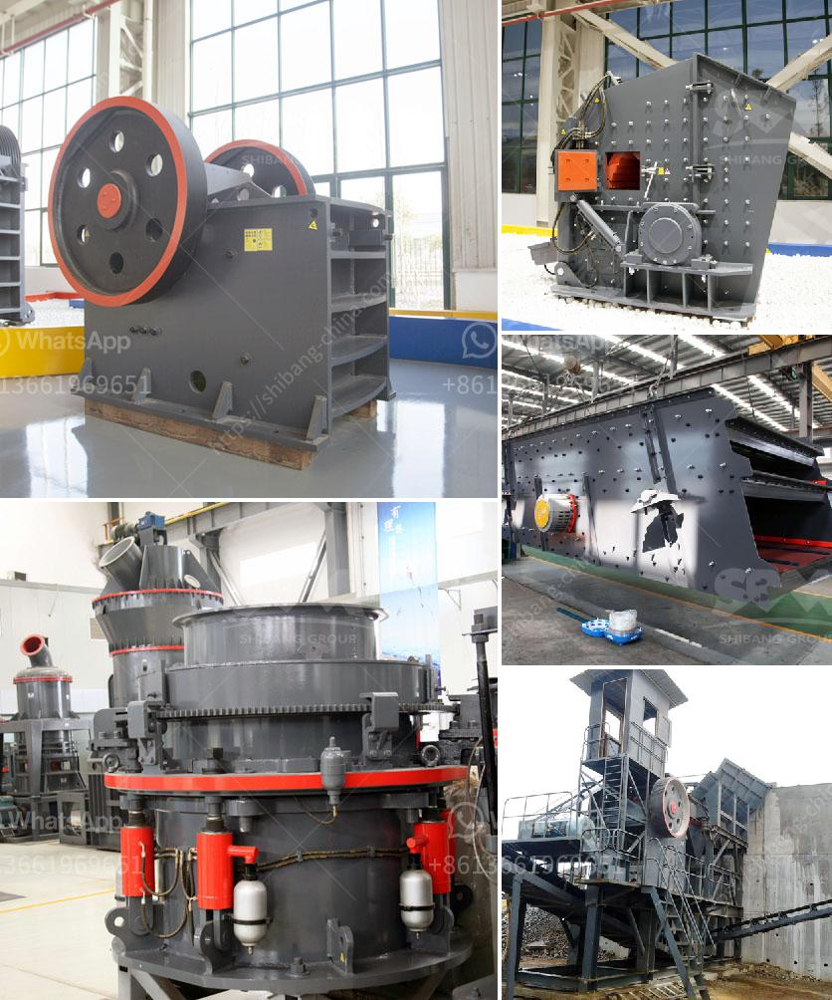

<h3>business plan of processing of calcium carbonate</h3>
1. Mining: Calcium carbonate ores are extracted from the mines and converted into powder form by crushing, grinding, and pulverizing. This process involves several stages and requires the use of various equipment such as crushers, mills, classifiers, and mixers.

2. Blending and homogenization: The crushed calcium carbonate is then mixed and homogenized to ensure a consistent product. This step is crucial as it helps to eliminate any impurities and ensure the final product's quality.

3. Purification: The blended calcium carbonate undergoes a purification process to remove any remaining impurities before further processing. This step is essential to achieve the desired purity level.

4. Precipitation: The purified calcium carbonate is then precipitated from a chemical solution by adding a precipitating agent such as sodium carbonate or sodium hydroxide. This process helps to separate the calcium carbonate from the solution and forms solid particles.

5. Drying: The precipitated calcium carbonate is then dried using various methods such as flash drying or rotary drying. This step is crucial to remove any moisture content and achieve the desired particle size and consistency.

6. Grinding and classification: The dried calcium carbonate is then finely ground to produce a powder with the desired particle size. This grinding process can be carried out using different types of mills such as ball mills, roller mills, or impact mills. The ground calcium carbonate is then classified based on particle size using classifiers or air separators.

7. Packaging and distribution: The final step involves packaging the processed calcium carbonate powder into different size bags or containers for distribution. The packaging may vary depending on the intended use of the product, such as industrial applications or consumer products.

As part of the business plan, it is crucial to consider various factors such as market demand, competition, pricing, and distribution channels. Conducting a thorough market analysis will help determine the potential customers and target markets for the processed calcium carbonate. It is essential to identify the industries that require calcium carbonate in their manufacturing processes, such as paper, plastics, paints, coatings, and construction materials.

Additionally, establishing a strong distribution network is crucial to ensure efficient and timely delivery of the product to the customers. This may involve partnerships with distributors or setting up a direct sales team to reach out to potential customers.

Furthermore, cost analysis is essential to determine the profitability of the calcium carbonate processing business. This includes evaluating the costs of mining, processing, equipment, labor, utilities, packaging, and distribution. It is crucial to strike a balance between the production volume and cost to maximize profitability.

The business plan should also encompass sustainability and environmental considerations. Implementing sustainable practices, such as using renewable energy sources or recycling process waste, can help reduce the environmental impact of calcium carbonate processing.

To conclude, processing calcium carbonate involves a series of steps, from mining and purification to grinding and packaging. Developing a comprehensive business plan considering various factors such as market demand, competition, pricing, and distribution will help ensure the success of the calcium carbonate processing business.
<h3>Contact us</h3><ul><li><strong>Whatsapp:&nbsp;<a href="https://wa.me/8613661969651">+8613661969651</a></strong></li><li><a href="https://swt.shibang-china.com/?git&amp;zhl&amp;business plan of processing of calcium carbonate"><strong>Online Service(chat now)</strong></a></li></ul><h3>Related</h3><ul><li><a href='coal washing machines.md'>coal washing machines</a></li><li><a href='how to calculate the powder conveying rate.md'>how to calculate the powder conveying rate</a></li><li><a href='bauxite crusher machine.md'>bauxite crusher machine</a></li><li><a href='grinding mill machine in ethiopia.md'>grinding mill machine in ethiopia</a></li><li><a href='rock crushing limpopo.md'>rock crushing limpopo</a></li></ul>