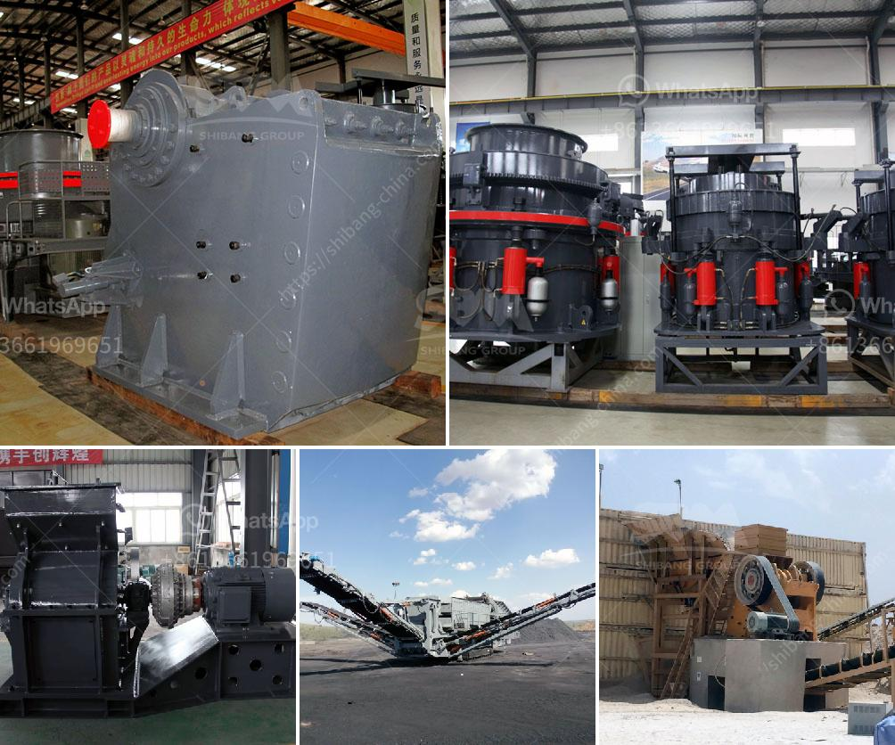

<h3>buy and sell conveyor belts in south africa</h3>
Conveyor belts play a crucial role in modern industrial production, ensuring the smooth and efficient movement of goods and materials. In South Africa, a country with a rapidly growing manufacturing and mining sector, the demand for conveyor belts is on the rise. This has created a vibrant market for both buying and selling conveyor belts, making it an exciting industry to explore and invest in.

South Africa's mining and manufacturing sectors have witnessed robust growth in recent years, contributing significantly to the country's economic development. With this growth comes an increased need for effective materials handling and transport systems to streamline operations. Conveyor belts have emerged as a reliable solution, fueling the demand in the market. From quarries and mines to warehouses and factories, conveyor belts are vital for ensuring the efficient movement of bulk materials, finished products, and components.

The market for conveyor belts in South Africa is highly competitive, with numerous suppliers and manufactures vying for market share. Local and international players offer a wide range of products, from basic conveyor belts to specialized variants designed for specific applications. This competitive environment benefits buyers as they have an extensive range of options available to suit their requirements.

Several factors contribute to the growing market of conveyor belts in South Africa. Firstly, the government's focus on infrastructure development and investments in mining and manufacturing industries is driving the demand. Secondly, automation and technological advancements have changed the landscape of industries, resulting in increased adoption of conveyor belts for enhancing productivity and efficiency. Lastly, the rising emphasis on workplace safety and ergonomics has further bolstered the market, prompting companies to invest in conveyor systems.

When buying conveyor belts in South Africa, it is essential to consider various factors. The application-specific requirements, such as material type, weight, and size, should be thoroughly assessed to select the most appropriate belt. The durability and reliability of the belt are crucial, as it should be able to withstand the rugged South African conditions. Additionally, factors such as maintenance requirements, warranty, and after-sales service should also be considered.

For entrepreneurs looking to venture into the conveyor belt business in South Africa, understanding market dynamics is imperative. Identifying niche segments and focusing on specialized conveyor belts can give the business a competitive advantage. Building strong relationships with customers and offering excellent customer service will foster customer loyalty and enhance the business's reputation. Additionally, partnerships with suppliers and manufacturers can help ensure a steady supply of high-quality conveyor belts.

The market for buying and selling conveyor belts in South Africa is thriving due to the country's growing mining and manufacturing sectors. This dynamic market offers ample opportunities for both buyers and sellers to cater to the needs of various industries. As South Africa continues to invest in its industrial infrastructure, the demand for conveyor belts is expected to grow further, making it an attractive industry to explore and invest in.
<h3>Contact us</h3><ul><li><strong>Whatsapp:&nbsp;<a href="https://wa.me/8613661969651">+8613661969651</a></strong></li><li><a href="https://swt.shibang-china.com/?git&amp;zhl&amp;buy and sell conveyor belts in south africa"><strong>Online Service(chat now)</strong></a></li></ul><h3>Related</h3><ul><li><a href='super fine roller mill.md'>super fine roller mill</a></li><li><a href='sample business plan for crushed stone.md'>sample business plan for crushed stone</a></li><li><a href='ballast crusher sale kenya.md'>ballast crusher sale kenya</a></li><li><a href='coal mining equipment for sale in germany.md'>coal mining equipment for sale in germany</a></li><li><a href='stone crusher suppliers in indore.md'>stone crusher suppliers in indore</a></li></ul>