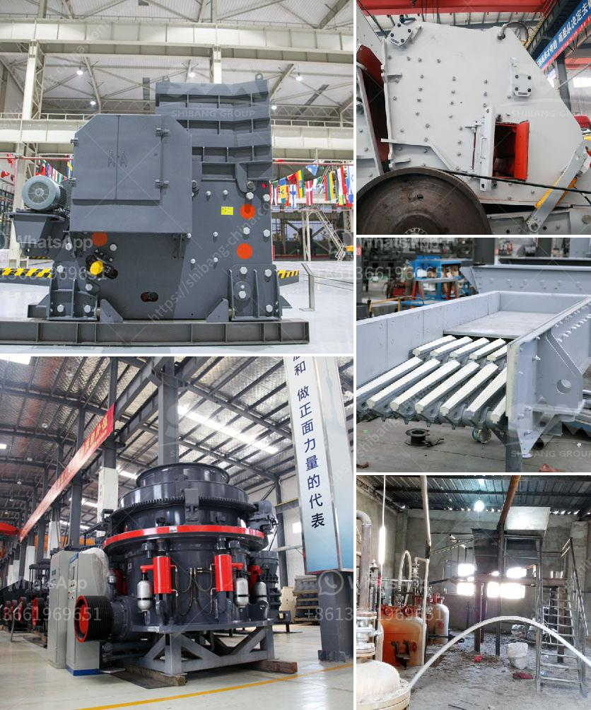

<h3>buy crusher plant</h3>
Investing in a crusher plant can be a lucrative venture for any business owner. This equipment plays a crucial role in the construction industry, as it helps break down large rocks into smaller pieces required for various construction projects. Whether you're a contractor or a quarry owner, purchasing a crusher plant can significantly boost your productivity and profitability.

One of the main benefits of buying a crusher plant is its ability to increase production capacity. With a reliable and efficient crusher plant, you can process more materials in a shorter amount of time. This means that you can take on more projects and complete them faster, ultimately generating higher revenue. Additionally, a crusher plant allows you to produce different types and sizes of aggregate materials, catering to the specific needs of your clients.

Another advantage of buying a crusher plant is cost savings. Instead of relying on external sources for crushed rocks, you can produce your own on-site. This eliminates the need for transportation costs and reduces the overall expenses associated with purchasing construction materials. Furthermore, having control over the production process ensures that the quality of your materials meets the highest standards, which can lead to repeat business and an enhanced reputation in the industry.

When selecting a crusher plant, it's essential to consider factors such as the type of material you'll be processing, the desired output size, and the capacity requirements. There are various types of crusher plants available, including jaw crushers, impact crushers, and cone crushers, each offering unique features and advantages. It's crucial to choose a plant that aligns with your specific needs and operational requirements.

In conclusion, buying a crusher plant can provide numerous benefits for businesses in the construction industry. Increased production capacity, cost savings, and improved quality control are just a few of the advantages that come with owning this equipment. If you're looking to boost your productivity and profitability, investing in a crusher plant may be a smart decision.
<h3>Contact us</h3><ul><li><strong>Whatsapp:&nbsp;<a href="https://wa.me/8613661969651">+8613661969651</a></strong></li><li><a href="https://swt.shibang-china.com/?git&amp;zhl&amp;buy crusher plant"><strong>Online Service(chat now)</strong></a></li></ul><h3>Related</h3><ul><li><a href='white cement plant machinery manufacturers.md'>white cement plant machinery manufacturers</a></li><li><a href='rock crushers ball mill.md'>rock crushers ball mill</a></li><li><a href='gold wash plant for sale in brazil.md'>gold wash plant for sale in brazil</a></li><li><a href='crushing and screening contractors in south africa.md'>crushing and screening contractors in south africa</a></li><li><a href='how to grind silica sand.md'>how to grind silica sand</a></li></ul>