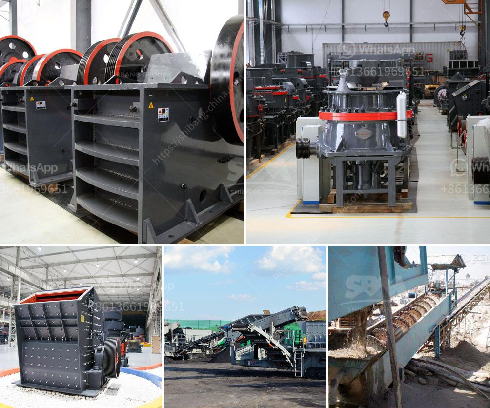

<h3>buy mobile crusher</h3>
Are you in the market for a mobile crusher? Look no further! Investing in a mobile crusher can truly revolutionize your operations, providing you with the flexibility to process materials on-site, save time, and increase profitability.

A mobile crusher is a machine designed to reduce large rocks into smaller rocks, gravel, or rock dust. It is compact in size and can be easily transported to different job sites, making it an ideal choice for construction and mining companies.

One of the key advantages of a mobile crusher is its versatility. It can process various types of materials, such as concrete, asphalt, and natural stones, making it suitable for a wide range of applications. Whether you need to crush materials for road construction, demolition, or recycling purposes, a mobile crusher can handle the task efficiently.

Another advantage of a mobile crusher is its ability to save time and reduce costs. Instead of relying on traditional crushers, which require materials to be transported to a fixed location, a mobile crusher can be brought directly to the job site. This eliminates the need for transportation and reduces the associated costs. The mobile crusher can also crush materials on-site, eliminating the need to haul them away and backfill the area afterwards.

Furthermore, a mobile crusher can increase your profitability by allowing you to process materials on-demand. Instead of stockpiling large quantities of crushed materials, you can crush them as needed, reducing the risk of material waste and saving on storage costs. This flexibility also allows you to respond quickly to changing demands, ensuring that you can meet customer requirements promptly.

When considering a mobile crusher, it is essential to choose a reliable and reputable manufacturer. Look for a company with a proven track record in the industry, offering high-quality machines that are built to last. Consider factors such as the crusher's capacity, mobility, fuel efficiency, and maintenance requirements to ensure that it meets your specific needs.

In conclusion, investing in a mobile crusher can bring numerous benefits to your operations. From increased flexibility and cost-savings to improved profitability, a mobile crusher is a valuable asset for any construction or mining company. So why wait? Purchase a mobile crusher today and take your operations to new heights!
<h3>Contact us</h3><ul><li><strong>Whatsapp:&nbsp;<a href="https://wa.me/8613661969651">+8613661969651</a></strong></li><li><a href="https://swt.shibang-china.com/?git&amp;zhl&amp;buy mobile crusher"><strong>Online Service(chat now)</strong></a></li></ul><h3>Related</h3><ul><li><a href='crusher sand and stone in kenya.md'>crusher sand and stone in kenya</a></li><li><a href='chilli powder making machine india price.md'>chilli powder making machine india price</a></li><li><a href='crushing and grinding.md'>crushing and grinding</a></li><li><a href='granite machine manufacturer india.md'>granite machine manufacturer india</a></li><li><a href='galena crushing and processing.md'>galena crushing and processing</a></li></ul>