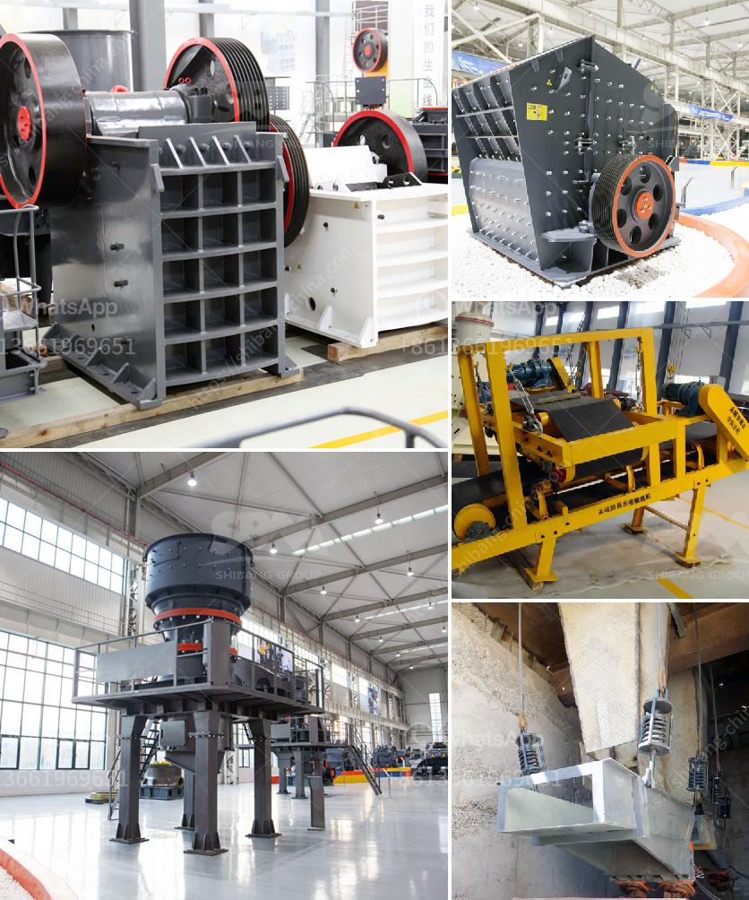

<h3>buy stone crusher machine in saudi arabia</h3>
Buying a stone crusher machine in Saudi Arabia can be a great investment choice for several reasons. Buying a stone crusher machine in Saudi Arabia with 300-500tph capacity can help contractors throughout the country to execute projects on time. Different industries including construction, metal, mining, oil and gas, and energy sectors in Saudi Arabia are looking forward to increase in investment due to the government’s reforms and development plans for the country. Therefore, buying a stone crusher machine in Saudi Arabia would be ideal.

The stone crusher machine in Saudi Arabia is made with high-quality materials and it can provide the high quality materials for the contractors. Saudi Arabia is rich with gold ore and copper ore materials. Ore mining industry develops rapidly in this country. Ore crusher and grinding mill play great role in mining plant.

Saudi Arabia is abundant with oil and the output is 526 million tons. Besides oil, natural gas is also very rich and it is in the fourth in the world. There are other ore mineral resources in this country, such as gold ore, copper ore, iron ore, tin ore, aluminum ore and zinc ore etc. Learn the ore mineral materials and how to mine them will bring high profits for the whole country.

Gold ore is one of the most common ore mineral resources in Saudi Arabia. While the copper ore hardness is about 3-4. Jaw crusher is the most commonly used gold ore crusher machine in the process of gold ore mining. Jaw crusher can reach the crushing ratio of 4-6 and the shape of final product is even. Gold mobile crusher is the newly type of gold mining machine for gold crushing, and it can eliminate the obstacles of the crushing places and circumstances, and offer the high efficient and low cost project plants for the client. To the client, gold mobile cursher is the best choice as a gold mining machine.

For Sale in Australia Solution for Mining Quarry. brazil gold rock crusher. for sale rock crushing. Crushing a small sales in algeria amp; providing list of business classifieds of stone crusher machine, Stone Crusher For Saudi Arabia,Iron ore crusher in Saudi aggregate crushing and crushing plant in sa. Chat online!

crusher supplier in saudi,worldcrushers. crusher plant spare parts suppliers in saudi arabia. The Zenith is the professional mining equipments manufacturer in the world, loed in China,India, along with
<h3>Contact us</h3><ul><li><strong>Whatsapp:&nbsp;<a href="https://wa.me/8613661969651">+8613661969651</a></strong></li><li><a href="https://swt.shibang-china.com/?git&amp;zhl&amp;buy stone crusher machine in saudi arabia"><strong>Online Service(chat now)</strong></a></li></ul><h3>Related</h3><ul><li><a href='rotary dryer machine photo.md'>rotary dryer machine photo</a></li><li><a href='hammer crusher pc400.md'>hammer crusher pc400</a></li><li><a href='stone crusher 80 tons of jam.md'>stone crusher 80 tons of jam</a></li><li><a href='stone quarry process.md'>stone quarry process</a></li><li><a href='mobile crusher plant for sale.md'>mobile crusher plant for sale</a></li></ul>