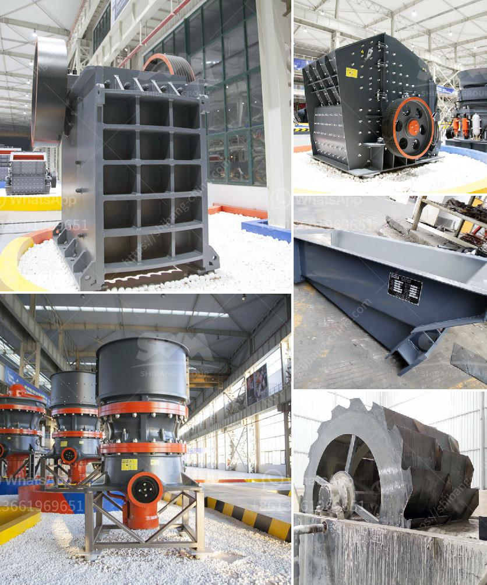

<h3>buy ultra fine grinder mill</h3>
Ultra fine grinder mill, also known as ultra fine milling machine, is used to process quartz, feldspar, calcite, limestone, talc, ceramics, marble, granite, dolomite, bauxite, iron ore, barite, coal gangue, coal and other materials. It is widely used in mining, metallurgy, chemical industry, building materials and other industries, with the Mohs hardness of less than 7 grades and humidity below 6%.

The ultra fine grinder mill has many advantages, such as high grinding efficiency, low power consumption, small footprint, less capital investment and environmental protection. Its grinding chamber is designed with a unique air self-circulation system, which greatly reduces the amount of air escaping from the mill and maintains a constant and stable system pressure, ensuring a high grinding efficiency and reliable operation.

One of the key features of the ultra fine grinder mill is the ability to produce fine and uniform particles. The grinding roller and grinding ring are made of special wear-resistant materials, which can greatly improve the service life of the equipment. The fineness of the finished product can be adjusted within the range of 325-2500 mesh according to the actual needs of customers, and the particle size distribution is even and fine.

In addition, the ultra fine grinder mill is equipped with an advanced electronic control system, which can monitor and control the grinding process in real time. It can automatically adjust the grinding pressure, feeding speed and other parameters according to the changes of the material hardness, humidity and other factors, thus ensuring the stability and reliability of the equipment operation.

The ultra fine grinder mill has a wide range of applications. It can be used for grinding various minerals, such as limestone, quartz, feldspar, calcite, talc, barite, clay, kaolin, gypsum, graphite, etc. It is also widely used in the fields of chemical industry, building materials, metallurgy, mining, refractory materials, ceramics, cement, abrasives and other industries.

When purchasing an ultra fine grinder mill, there are some factors that need to be considered. Firstly, the grinding capacity, which is related to the fineness of the finished product, should be selected according to the actual production needs. Secondly, the energy consumption and operating cost should be considered. A high grinding efficiency and low energy consumption equipment will save a lot of energy costs in the long run. Thirdly, the after-sales service of the manufacturer should be considered. A professional manufacturer with good after-sales service can provide technical support, maintenance and repair services in a timely manner, ensuring the normal operation of the equipment.

In summary, the ultra fine grinder mill is a high-efficiency and energy-saving grinding equipment, which is widely used in various industries. It has the advantages of uniform and fine particle size, high grinding efficiency, low power consumption, small footprint, etc. It is an ideal choice for processing various minerals and materials. When purchasing, customers should consider the actual production needs, energy consumption, after-sales service, etc., in order to choose a suitable ultra fine grinder mill.
<h3>Contact us</h3><ul><li><strong>Whatsapp:&nbsp;<a href="https://wa.me/8613661969651">+8613661969651</a></strong></li><li><a href="https://swt.shibang-china.com/?git&amp;zhl&amp;buy ultra fine grinder mill"><strong>Online Service(chat now)</strong></a></li></ul><h3>Related</h3><ul><li><a href='equipment design of coal washing plant.md'>equipment design of coal washing plant</a></li><li><a href='manufacturing process of mica crusher.md'>manufacturing process of mica crusher</a></li><li><a href='pharma grade kaolin process.md'>pharma grade kaolin process</a></li><li><a href='ballast crusher sale kenya.md'>ballast crusher sale kenya</a></li><li><a href='coal grinding plant.md'>coal grinding plant</a></li></ul>