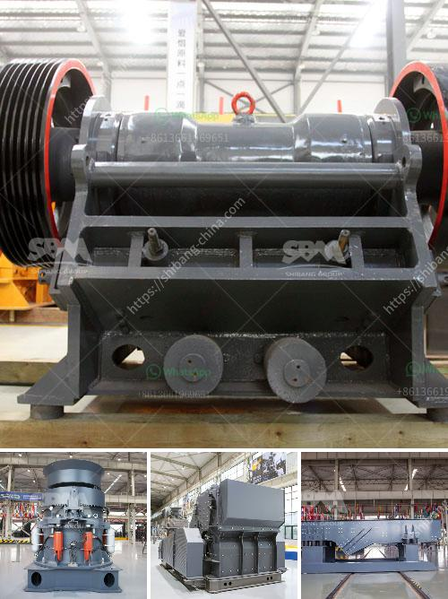

<h3>caco3 plant parts</h3>
Calcium carbonate (CaCO3) is a naturally occurring mineral that plays a vital role in various plant functions. It is found in many parts of plants and serves as a fundamental building block for their growth and development. In this article, we will explore the different plant parts where calcium carbonate is present and its importance.

Firstly, calcium carbonate is a key component in the cell walls of plants. It provides structural support and strength to the plant, making it more resistant to external pressures. The presence of calcium carbonate in the cell walls helps plants maintain their upright position, especially in taller species. This mineral also helps plants to withstand mechanical stresses and prevents them from collapsing under their own weight.

Another important part of the plant where calcium carbonate is found is in the xylem vessels. Xylem is responsible for transporting water and minerals from the roots to the other parts of the plant. Calcium ions are absorbed by the roots from the soil and are transported through the xylem vessels in the form of calcium carbonate. This mineral travels to the shoots, leaves, and reproductive structures, ensuring the proper growth and development of these plant parts.

In addition to structural support and transportation, calcium carbonate also plays a crucial role in the regulation of a plant's physiological processes. It acts as a signaling molecule, helping the plant respond to different external and internal stimuli. Calcium ions are involved in various cellular signaling pathways, including enzyme activation, hormone synthesis, and gene expression. This mineral helps plants to coordinate their growth, development, and responses to environmental cues such as light, temperature, and water availability.

Calcium carbonate also plays a significant role in the plant's defense mechanisms. When a plant is attacked by pathogens or insects, it releases calcium ions to the site of injury. These ions help to reinforce the cell walls, making it more challenging for the pathogens or insects to penetrate and invade the plant tissue. Calcium ions also stimulate the production of defensive compounds, such as phytoalexins and lignin, which further protect the plant against microbial and herbivore attacks.

Furthermore, calcium carbonate contributes to the regulation of soil pH. It acts as a natural buffer, maintaining the soil's pH within the optimum range for plant growth. Calcium ions released from calcium carbonate help to neutralize excessive acidity in the soil. This is particularly essential in acidic soils, where the presence of calcium carbonate helps to create a more favorable environment for plant roots.

Overall, calcium carbonate is an essential mineral for plant growth and development. It is found in various parts of plants, including cell walls, xylem vessels, shoots, leaves, and reproductive structures. Calcium carbonate provides structural support, enhances the plant's defense mechanisms, regulates physiological processes, and helps maintain the soil's pH. Its presence ensures the efficient functioning of plants and their ability to adapt to different environmental challenges.
<h3>Contact us</h3><ul><li><strong>Whatsapp:&nbsp;<a href="https://wa.me/8613661969651">+8613661969651</a></strong></li><li><a href="https://swt.shibang-china.com/?git&amp;zhl&amp;caco3 plant parts"><strong>Online Service(chat now)</strong></a></li></ul><h3>Related</h3><ul><li><a href='format of the business plan for stone crusher.md'>format of the business plan for stone crusher</a></li><li><a href='400 mesh grinding mill equipment.md'>400 mesh grinding mill equipment</a></li><li><a href='crushing plant in maule.md'>crushing plant in maule</a></li><li><a href='complete plant copper extraction processing for sale.md'>complete plant copper extraction processing for sale</a></li><li><a href='small size gold mining business plan.md'>small size gold mining business plan</a></li></ul>