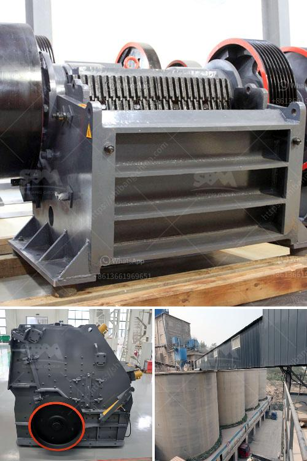

<h3>calcining machine for gypsum factory from taiwan</h3>
Calcining Machine for Gypsum Factory from Taiwan: A Revolutionary Solution in the Construction Industry

The construction industry is witnessing continuous advancements in materials and machinery, aimed at improving efficiency and productivity. One such innovation that has made its mark in the industry is the calcining machine for gypsum factories, particularly those manufactured in Taiwan. This cutting-edge technology has revolutionized the gypsum manufacturing process, offering numerous benefits to gypsum factories worldwide.

Gypsum is a widely used material in construction, known for its versatility and excellent fire resistance properties. However, extracting gypsum from its source and processing it into the required form can be a complex and energy-intensive process. This is where the calcining machine from Taiwan comes into play, simplifying the process and minimizing energy consumption.

The calcining machine for gypsum factories from Taiwan is designed to calcine gypsum effectively, converting it into a usable form. The machine utilizes advanced technology to remove the chemically combined water from the gypsum, resulting in a dry and porous product known as calcined gypsum or plaster of Paris.

One of the key advantages of using this calcining machine is its ability to control the calcination process precisely. The machine ensures uniform heating and calcination of gypsum, enhancing the quality and consistency of the end product. With manual and automated controls, it allows operators to monitor and adjust the process parameters, optimizing the production output.

Moreover, the calcining machine from Taiwan boasts a high-capacity design, enabling gypsum factories to meet the growing demands of the construction industry. It can process a significant volume of gypsum within a shorter time frame, increasing productivity and reducing production costs. Additionally, the machine minimizes waste generation, thanks to its efficient and reliable operation.

Another noteworthy feature of the calcining machine is its energy efficiency. By optimizing the utilization of heat during the calcination process, it reduces energy consumption and lowers the carbon footprint of gypsum manufacturing. This aligns with the growing global focus on sustainable construction practices and green initiatives.

In conclusion, the calcining machine for gypsum factories from Taiwan has emerged as a game-changer in the construction industry. Its advanced technology, precise control, high capacity, and energy efficiency make it a valuable asset for gypsum manufacturing plants worldwide. With the ability to produce superior quality plaster of Paris in a cost-effective and environmentally friendly manner, this machine is shaping the future of gypsum production and contributing to sustainable construction practices.
<h3>Contact us</h3><ul><li><strong>Whatsapp:&nbsp;<a href="https://wa.me/8613661969651">+8613661969651</a></strong></li><li><a href="https://swt.shibang-china.com/?git&amp;zhl&amp;calcining machine for gypsum factory from taiwan"><strong>Online Service(chat now)</strong></a></li></ul><h3>Related</h3><ul><li><a href='brick factory for sale in uk.md'>brick factory for sale in uk</a></li><li><a href='jaw crusher plant price.md'>jaw crusher plant price</a></li><li><a href='jaw crusher powder malaysia.md'>jaw crusher powder malaysia</a></li><li><a href='usina de minerio de ferro para venda no mexico.md'>usina de minerio de ferro para venda no mexico</a></li><li><a href='gold ore mining equipment companies in germany.md'>gold ore mining equipment companies in germany</a></li></ul>