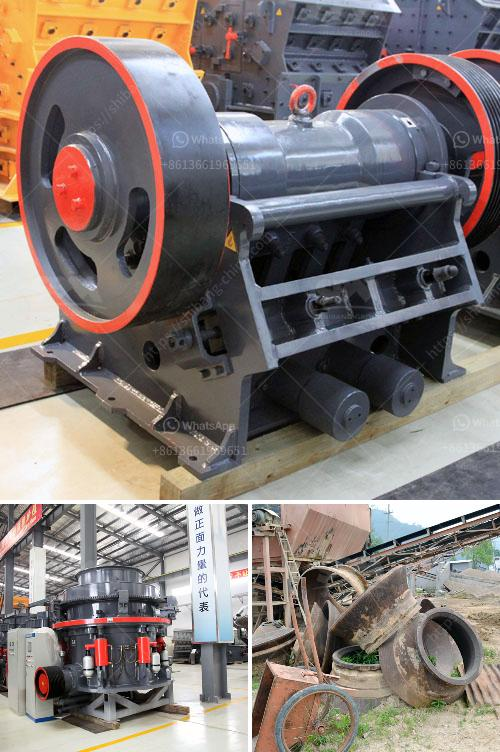

<h3>calcite grinding machine manufacturer in udaipur</h3>
Calcite is a calcium carbonate mineral, commonly known as limestone. It has a wide range of applications in industries like paint, paper, plastics, rubber, ceramic, pharmaceutical, and many more. Calcite powder is a crucial ingredient in manufacturing various products that require an extensive range of grind sizes.

To meet the diversified requirements of industries, the demand for calcite powder is increasing rapidly. Therefore, the need for calcite grinding machines is also escalating. Udaipur, a beautiful city in Rajasthan, India, is renowned for its rich mineral resources and is home to several manufacturers catering to the growing demand for calcite grinding machines.

One of the leading manufacturers in Udaipur specializing in the production of calcite grinding machines is Vinayak Engineering Works. Established in the year 1995, the company has gained a considerable reputation in the industry for its high-quality machines and excellent customer service.

Vinayak Engineering Works is equipped with the latest technology and state-of-the-art machinery to ensure the manufacturing of top-notch calcite grinding machines. The company's team of highly skilled engineers and technicians work tirelessly to develop innovative machines that meet the specific requirements of its clients.

The calcite grinding machines manufactured by Vinayak Engineering Works are known for their exceptional efficiency and durability. These machines are designed to provide uniform particle size distribution and are capable of grinding a wide range of materials, from soft to medium-hard minerals.

Vinayak Engineering Works offers a comprehensive range of calcite grinding machines, including ball mills, Raymond mills, trapezium mills, ultrafine mills, and vertical roller mills, among others. These machines allow for precise grinding of calcite materials to achieve the desired particle size.

In addition to manufacturing high-quality calcite grinding machines, Vinayak Engineering Works also provides excellent after-sales service. The company has a team of experienced technicians who are always ready to assist customers with any technical issues or maintenance requirements.

Furthermore, Vinayak Engineering Works believes in fostering long-term relationships with its clients. The company strives to understand the unique needs of each customer and offer customized solutions accordingly. This customer-centric approach has earned Vinayak Engineering Works a loyal clientele and a strong reputation in the industry.

As the demand for calcite grinding machines continues to rise, manufacturers like Vinayak Engineering Works play a crucial role in meeting market demands. Their commitment to delivering reliable and efficient machines, along with exceptional customer service, has made them a trusted name in the industry.

In conclusion, calcite grinding machines are essential for various industries requiring finely ground calcite powder. Udaipur, with its rich mineral resources, is home to leading manufacturers like Vinayak Engineering Works, who deliver high-quality machines to meet the evolving needs of their customers. Their dedication to innovation and customer satisfaction ensures that the calcite grinding machines manufactured in Udaipur are of top-notch quality.
<h3>Contact us</h3><ul><li><strong>Whatsapp:&nbsp;<a href="https://wa.me/8613661969651">+8613661969651</a></strong></li><li><a href="https://swt.shibang-china.com/?git&amp;zhl&amp;calcite grinding machine manufacturer in udaipur"><strong>Online Service(chat now)</strong></a></li></ul><h3>Related</h3><ul><li><a href='crusher plant business requirement in paistan.md'>crusher plant business requirement in paistan</a></li><li><a href='crushers of jaw china.md'>crushers of jaw china</a></li><li><a href='companies selling mining equipment.md'>companies selling mining equipment</a></li><li><a href='calcium carbonate manufacturing in egypt.md'>calcium carbonate manufacturing in egypt</a></li><li><a href='how pyrite mined and processed.md'>how pyrite mined and processed</a></li></ul>