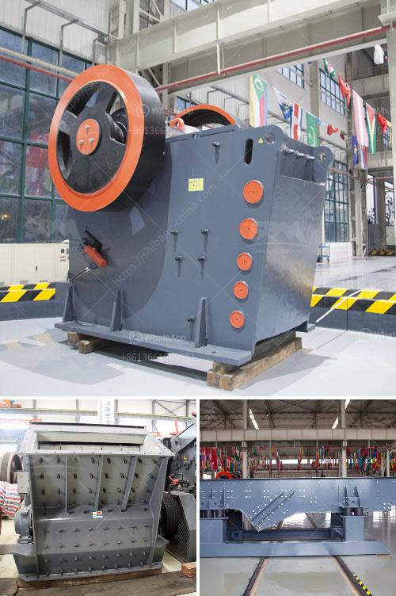

<h3>calcite manufacturing</h3>
Calcite, a common and widespread mineral, holds immense importance in various industries due to its versatile properties. From construction to agriculture, calcite plays a vital role in numerous applications. In this article, we will explore the manufacturing process of calcite and its significance in various sectors.

Calcite is primarily composed of calcium carbonate (CaCO3), making it a crucial source of calcium for many industries. The manufacturing process of calcite involves extracting and refining this mineral for various applications. Let's delve into the details of calcite manufacturing to gain a comprehensive understanding of its production process.

Extraction: The process begins with the extraction of calcite from the earth's crust. Calcite deposits are usually found in limestone formations, where the mineral is formed over millions of years through the sedimentation of marine organisms' shells and skeletons. These limestone formations are typically mined through open-pit or underground mining methods.

Crushing and Grinding: Once the calcite is extracted, it undergoes crushing and grinding processes to obtain fine particles. The extracted calcite is usually too large to be directly used in manufacturing applications, so it is crushed into smaller pieces. Subsequently, the crushed calcite is further ground to achieve the desired particle size. Grinding of calcite not only improves its fineness but also enhances its reactivity and functionality in different industries.

Purification: To ensure the highest quality, the extracted and ground calcite undergoes a purification process. Impurities such as clay, silica, and organic matter are removed from the calcite through various techniques such as washing, settling, flotation, and magnetic separation. This purification process ensures that the final calcite product meets the required standards of purity and consistency.

Processing: After purification, the calcite is processed into different forms based on its intended applications. Some common forms of processed calcite include granules, powders, and micronized calcite. Granules of calcite are commonly used in the manufacturing of fertilizers, due to their slow-release properties, while calcite powders find applications in construction, paints, adhesives, and paper industries. Micronized calcite, with its ultrafine particle size, has various uses in the plastic, rubber, and paint industries.

Applications: Calcite finds extensive utilization in numerous industries, owing to its unique properties. In construction, calcite is used as a key ingredient in cement, concrete, and asphalt, providing strength and durability to these materials. The paper industry relies on calcite as a filler, enhancing the brightness, opacity, and smoothness of paper products. Calcite is also used in the manufacturing of paints and coatings, as it acts as an extender, improving the color retention and spreading properties of the products.

Moreover, calcite is widely employed in agriculture as a soil conditioner and pH regulator. It neutralizes the acidity of the soil, improving its fertility and facilitating better plant growth. In the pharmaceutical industry, calcite is used in the production of various medications and dietary supplements.

In conclusion, the manufacturing process of calcite involves extraction, crushing, grinding, purification, and processing to obtain different forms for various applications. Its wide utilization across industries illustrates the significance of this mineral. Whether in construction, agriculture, or pharmaceuticals, calcite enhances the properties of numerous products, playing a vital role in our daily lives.
<h3>Contact us</h3><ul><li><strong>Whatsapp:&nbsp;<a href="https://wa.me/8613661969651">+8613661969651</a></strong></li><li><a href="https://swt.shibang-china.com/?git&amp;zhl&amp;calcite manufacturing"><strong>Online Service(chat now)</strong></a></li></ul><h3>Related</h3><ul><li><a href='crusher plant layout.md'>crusher plant layout</a></li><li><a href='sand screener and washer.md'>sand screener and washer</a></li><li><a href='gypsum portland cement retarder manufacturer usa.md'>gypsum portland cement retarder manufacturer usa</a></li><li><a href='stone crushing machines in uk.md'>stone crushing machines in uk</a></li><li><a href='used barite crusher price.md'>used barite crusher price</a></li></ul>